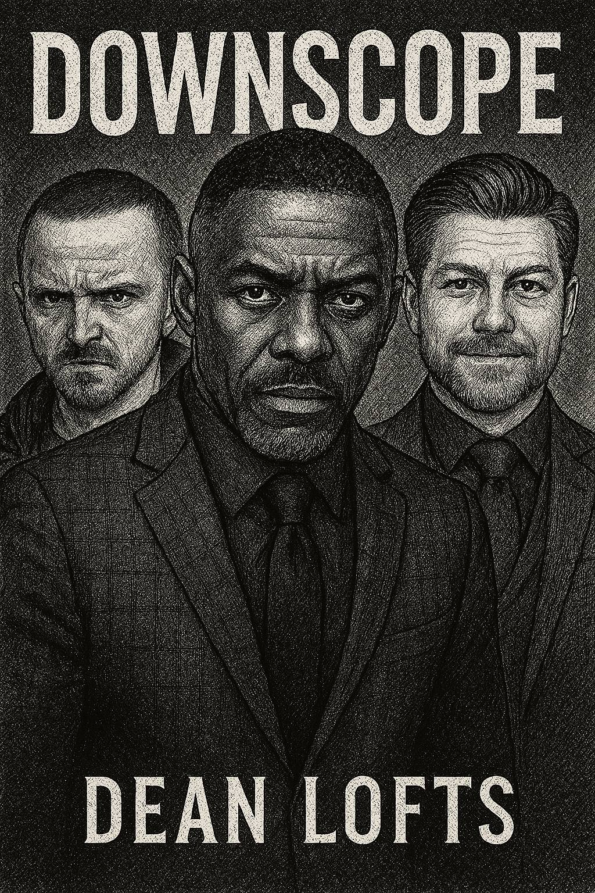

# CHAPTER 5: "RECONFIGURED REALITIES"

> "The most successful systems of control are not those which eliminate all unauthorized behaviors, but those which make such behaviors irrelevant by modifying the environment around them."
> — Internal Infrastructure Team Document, "Technical Debt & Organizational Dynamics," attributed to Rhys Edwards

---

## 1. THE ASCENSION OF DEREK MILLER

"Look, Connor, it's not just about whether it *works*," Derek Miller's voice boomed through the shared audio channel of the mandatory Team Catalyst 'Synergy Standup' video call, pitched perfectly to ensure maximum impact despite the digital distance. "It's about coding to the *standards* of a truly enterprise-grade solution. This implementation is, frankly, substantially below what I'd expect from a Senior Engineer on Team Catalyst."

On the grid of pixelated faces, Connor Wright sat hunched in his home office chair, the glow of his monitor reflecting off his rapidly reddening forehead as Derek dominated the call, gesturing emphatically at the pull request Connor had shared on screen. The PR in question, a modest refactoring of the billing integration service, had been open for less than four hours. Connor had completed it overnight, a response to Derek's "urgent strategic priority" email sent at 6:47 PM the previous evening.

"I mean, just look at these class structures," Derek continued, his virtual background (a stock photo of soaring eagles over mountain peaks) providing a jarringly majestic backdrop to his critique. His voice dripped with exaggerated disappointment. "Where's the proper abstraction layering? The separation of concerns? The extensibility patterns we discussed in the architecture sync last week?"

Connor's fingers hovered uncertainly over his keyboard, muted indicator flashing. "I was focusing on making the service more maintainable without changing the API contract, like you asked. I thought keeping the changes minimal would reduce regression risks since the billing system is pretty central."

"Minimal?" Derek scoffed, the sound sharp enough to make several other muted team members visibly wince on camera. "Connor, minimal effort is precisely the problem I'm seeing here. When I was actively coding complex infrastructure systems back in the day," he paused, seeming to savor the fabricated memory for the virtual audience, "I always made sure to implement robust patterns from the start. Technical debt is created in exactly these moments of, forgive me, laziness."

From his own remote workspace, Jules Tucker kept his face carefully neutral, eyes fixed on his own screen despite the impossible-to-ignore confrontation dominating the team call. He'd been transitioning most of his work to the Aether team, but still maintained enough presence with Team Catalyst (primarily attending mandatory meetings while multitasking) to witness Derek's increasingly erratic management style since the official confirmation of his promotion to Head of Product.

Derek's "back in the day" infrastructure expertise was a particularly ironic fabrication given Jules's inside knowledge of Project Carry Derek, the elaborate containment system designed specifically because Derek had never successfully implemented anything in infrastructure without causing catastrophic damage. The system had been decommissioned weeks ago, deemed unnecessary now that Derek's role kept him safely away from any direct technical implementation access. *Or so we thought*, Jules mused grimly.

"Here, let me show you," Derek said, voice shifting to exaggerated helpfulness. "Stop sharing, Connor. I'll share my screen and demonstrate."

Connor reluctantly relinquished screen control, his square on the video grid shrinking as Derek’s shared IDE filled the view. Derek settled back with the confident air of someone about to reveal divine wisdom via screen share. "Watch closely now, because this is how we architect scalable systems."

Derek's fingers moved across the keyboard with practiced showmanship, typing rapidly if not particularly accurately into a local copy of Connor's code. Jules found himself tensing instinctively, years of PCD-awareness making him half-expect monitoring alerts to start blaring. But of course, Derek wasn't actually accessing any critical systems, just modifying local code, safely contained within his own machine, yet performing the changes live for the entire team.

"See, you want to abstract the billing provider behind an interface," Derek explained, typing furiously. "Then implement the strategy pattern so we can swap providers. Then a factory to instantiate the right strategy. Then a decorator for logging. And a façade to simplify the client API. And of course a singleton to manage the connection pool."

Jules watched in horrified fascination as Derek proceeded to implement what appeared to be every design pattern he'd ever heard of, simultaneously, creating a byzantine maze of unnecessary abstractions that would make the simple billing integration nearly incomprehensible. Connor's expression, visible in his small video tile, shifted from embarrassment to confusion to barely concealed alarm as his straightforward code transformed into a tangled nightmare on Derek's shared screen.

"There!" Derek declared triumphantly after fifteen minutes of rapid typing. "That's how you architect for the enterprise. Multiple layers of abstraction, everything behind interfaces, factory patterns throughout. Now it's properly extensible and follows best practices."

The code displayed was a disaster: class hierarchies seven levels deep, potential circular dependencies, methods that did nothing but delegate, factories creating factories. Jules knew it would likely introduce more bugs than it solved, would be nearly impossible to debug, and added no actual business value. But Derek beamed with pride, leaning back from his camera to admire his work like an artist before a masterpiece.

"I'll commit these improvements to your branch, Connor," Derek announced cheerfully. "It's a teaching moment for the whole team, really. Sometimes you have to see proper architecture to understand it."

Connor managed a weak nod, clearly too junior to challenge his newly promoted manager but visibly distressed at what had happened to his code branch. "Thanks for the, uh, guidance, Derek."

"Anytime!" Derek declared. "That's what leadership is about: sharing expertise, elevating the team. I've been around the block a few times, seen how these systems should be built. During the Aether project, for instance," he raised his voice slightly, ensuring the claim carried over the audio connection, "I was instrumental in establishing the core authentication patterns that enabled the whole thing."

Jules felt a familiar twist in his gut, the same one he'd experienced during the hackathon when his authentication system had been attributed to Max Murphy. But time and perspective had tempered his reaction. He knew that his contribution was now properly acknowledged within the Aether team, that his name was clearly on the design documents, and that the people who mattered recognized his work. Derek's revisionist history, delivered performatively on a team call, was merely a harmless, if annoying, attempt to associate himself with success.

Derek wasn't done with his performance. "Connor, I need you to pick up the pace on these refactoring tickets. When I was handling these systems, I could knock out three or four major components a day. The velocity was just different back then."

"You were refactoring core billing systems yourself?" Connor asked, momentary confusion overcoming his deference, his voice small over the audio feed.

"Absolutely. Infrastructure, billing, authentication, you name it. Jack of all trades, master of most," Derek laughed at his own joke. "But now my focus needs to be strategic. Visionary. That's why I'm counting on you to step up, Connor. Right now, frankly, you're not where you need to be performance-wise."

Jules couldn't help but glance toward Connor's video feed, recognizing the familiar signs of a junior engineer being crushed under impossible expectations and public criticism. The young man's shoulders had hunched further, his earlier embarrassment hardening into something more concerning, resignation perhaps, or dawning despair, visible even in the low-resolution video.

"I'll try to improve," Connor mumbled, his microphone barely picking up the sound.

"Don't try, do!" Derek declared, slapping his own desk for emphasis, the sound loud enough to make several people jump on the call. "That's what Team Catalyst is about: EXECUTION, INNOVATION, DISRUPTION!" Each word was delivered with increasing volume. "I expect that refactoring complete, with proper enterprise patterns like I've shown, by EOD. Then we can discuss the user profile service. That one needs a complete architectural overhaul."

Derek finally ended the call, leaving the team blinking in the sudden silence, satisfied with his virtual performance. He was likely already composing a triumphant Slack message about his "successful coaching session."

Once the call disconnected, Jules immediately opened a direct message to Connor.

`Jules Tucker: Hey Connor, got a minute? Saw the call. That was… intense.`

Connor's reply came back instantly.

`Connor Wright: Intense is one word for it. Still trying to figure out how to undo Derek’s "improvements" without causing a merge conflict tornado. That commit he pushed is a nightmare.`

`Jules Tucker: Happy to jump on a quick screen share and help you git reset back to sanity? What Derek just did wasn't architecture, it was abstract art via copy-paste.`

`Connor Wright: Would you? Seriously? I don’t even know where to start. I don’t think his version would even compile.`

`Jules Tucker: Sending a Zoom link now. And FWIW, your original approach was correct. Minimal changes, reduce regression risk – exactly right for a critical system.`

As Jules initiated the private call with Connor, guiding him through restoring the codebase to its previous, functional state, he found himself reflecting on the strange new reality of Innovate Solutions. Project Carry Derek had been decommissioned, deemed unnecessary now that Derek's promotion kept him away from critically dangerous systems access. Yet the unintended consequence was that Derek was now inflicting a different kind of damage: undermining the confidence and development of junior engineers like Connor, spreading architectural misinformation, and creating a toxic virtual environment within what remained of Team Catalyst.

The quiet irony wasn't lost on Jules. In protecting the company's technical systems, Infra had inadvertently shifted the damage to the human elements, a trade-off no one had fully anticipated when making the decision to decommission PCD. Rhys's systems thinking had correctly anticipated the elimination of immediate technical risk through structural changes, but perhaps overlooked the second-order effects on team dynamics and individual engineers caught in Derek's virtual orbit.

"Thanks for this, Jules," Connor said as they completed the restoration, relief washing over his face on the video feed. "I was seriously considering updating my LinkedIn after that team call."

"Hang in there," Jules replied, genuinely concerned. "Derek's... well, he has his own unique perspective on technical matters."

"That's a diplomatic way to put it," Connor said with a wry smile. "Between us, I'm not sure he's ever actually written production code. Some of the things he suggests are just..."

"Violate the laws of physics, let alone software engineering?" Jules offered.

"Exactly! Last week he wanted me to implement 'quantum-resistant encryption' for our internal user preferences API. When I asked why, he said 'future-proofing' and something about Chinese hackers."

Jules suppressed a smile. "User preferences like theme settings and notification preferences?"

"The very same. Apparently they're a prime target for quantum computing attacks."

Their shared moment of quiet commiseration was interrupted by a notification on Jules's laptop: a calendar alert for the Aether weekly architecture sync. He made his excuses to Connor and prepared to join the next Zoom call, gathering his notes. As he waited for the Aether sync to start, he saw Derek's Slack status switch to "In a meeting 📞 - Executing Vision!" complete with a rocket emoji, wholly oblivious to the chaos he'd just created for his team.

The Aether sync offered a stark contrast to the dysfunction Jules had just witnessed. Efficient, focused, technically precise contributions from each team member joining from their respective remote locations. Max sharing vector database metrics, Sarah outlining endpoint response time improvements, Eli presenting a new approach to data ingestion. No grandstanding, no unnecessary abstractions, no politics disguised as technical guidance. Just engineers solving real problems with clear-eyed pragmatism.

As Jules presented his authentication system updates, he felt the comforting certainty that he was finally in the right place, contributing to a project that mattered in an environment that valued substance over performance. The human damage Derek was causing to Team Catalyst remained concerning, but Jules's primary responsibility now lay with Aether, one of the few projects at Innovate Solutions that seemed to be navigating the chaotic corporate waters with a clear direction and purpose, even in their dispersed, remote reality.

## 2. MYSTERIOUS SUMMONS

The envelope arrived on a Thursday morning, slipped under Emma Layton's apartment door while she was in the shower. No postmark, no return address. Just her name printed in block letters on heavy cream paper, the kind used for wedding invitations or legal documents.

Emma nearly missed it, her morning routine now so mechanically precise that variations in her environment often failed to register. She'd become a creature of habit, operating on autopilot: wake at precisely 6:17 AM, two minutes before her alarm; shower for exactly seven minutes; apply makeup with surgical precision; dress in one of five rotation-ready professional outfits; consume exactly one and a half cups of coffee while scanning overnight Slack messages. The envelope, lying just inside her threshold, disrupted this careful choreography. Her foot nudged it as she moved toward the kitchen, causing her to look down in momentary confusion.

She picked it up cautiously, the heavy paper feeling oddly formal in her hands. Inside was a single sheet containing what appeared to be a delivery notification:

> PACKAGE RECEIPT
> 
> Customer: E. LAYTON
> Reference: BTC-3A7B9C8D-#321
> Item: AWAITING PICKUP
> Location: SUNRISE IMPORTS
> Address: 2274 GARRISON STREET, UNIT C
> Hours: 2PM-10PM
> Notes: PERSONAL COLLECTION ONLY. BRING THIS RECEIPT.

The reference number sent a cold spike of recognition through Emma's body. BTC—Bitcoin. Followed by characters from the transaction hash that had haunted her for weeks, the one representing the 2.713 BTC she'd sent during her blackout rage. This wasn't some random delivery notification. This was connected to that night, to the transaction, to the dark forums she'd visited in her drunken state.

Her first instinct was to burn the paper, to pretend she'd never received it. But a sick curiosity mingled with dread kept her staring at the address. Garrison Street was in a transitional neighborhood—not overtly dangerous, but certainly not the kind of area that housed legitimate businesses catering to her usual demographic. "Sunrise Imports" sounded like a transparent front operation, the kind of place with permanently papered windows and irregular hours.

Emma's hands trembled as she set the note on her kitchen counter, continuing her morning routine through sheer force of habit. Her mind raced with possibilities, each more terrifying than the last. Was this confirmation that she'd ordered a hit on Victor? Was someone expecting her to retrieve proof, or payment, or God knew what else? Or was it something simpler but still horrifying—blackmail material, perhaps, from someone who had traced the Bitcoin transaction and connected it to her?

She should ignore it. Destroy the note. Pretend it never happened. That would be the sensible course of action.

Instead, she found herself entering the address into her maps app during a break between morning meetings, calculating the travel time from her apartment, studying the street view. Sunrise Imports appeared to be exactly what she'd expected—a nondescript storefront with tinted windows, sandwiched between a check-cashing place and a discount electronics repair shop. There was no website, no reviews, no digital footprint at all.

The day crawled by, Emma's attention fractured between her work responsibilities and the increasingly insistent pull of the mysterious receipt. The reference to her Bitcoin transaction was too specific to be coincidence. Someone knew what she'd done—or what she'd tried to do—and expected her to appear at this location. The rational voice in her head screamed that this was dangerous, potentially illegal, absolutely something to avoid.

But a darker compulsion drove her decision-making. If this was connected to Victor's death, she *needed* to know. The unbearable weight of not knowing, of living with the possibility that she might have blood on her hands, had become a torture worse than any potential danger. At least certainty, however horrifying, would end the psychological torment of ambiguity.

At 6:30 PM, after a day of mechanical productivity that belied her internal chaos, Emma found herself standing across the street from Sunrise Imports, the receipt clutched in her hand. The establishment looked even less reputable in person than it had in street view—metal security grates covered the windows, though lights were visible inside, and a small sign with limited hours matched those on her receipt. A few people entered and exited as she watched, most looking like locals from the neighborhood, carrying small packages or bags.

Her heart hammered against her ribs as she finally forced herself to cross the street. This was madness. She was potentially walking into a criminal enterprise, alone, with no one knowing her whereabouts, carrying evidence of a Bitcoin transaction potentially linked to a man's death. Yet she couldn't stop herself. The need to know had become overwhelming, driving her forward despite her terror.

The door opened with a electronic chime that seemed jarringly ordinary. Inside, Sunrise Imports presented itself as a cramped but not entirely suspicious neighborhood shipping and receiving center. A counter ran along one wall, behind which a bored-looking young man with elaborate tattoos scrolled on his phone. Various shipping supplies lined the opposite wall, and a few plastic chairs provided a waiting area. Two other customers were present—an elderly woman collecting a package, and a teenager dropping off what appeared to be a return shipment.

Emma approached the counter hesitantly, her knuckles white around the receipt. The normalcy of the scene was somehow more terrifying than if she'd walked into an obvious criminal front. The mundane veneer made everything more surreal, more disorienting.

"Can I help you?" the tattooed clerk asked without looking up from his phone.

"I... I have this receipt," Emma managed, her voice barely audible. She slid the paper across the counter. "For a pickup."

The clerk glanced at the receipt, then immediately put his phone down, his demeanor shifting subtly. He studied Emma with new interest, then nodded once. "Yeah, special handling. One sec."

He disappeared through a door behind the counter, leaving Emma standing rigidly in place, fighting the urge to flee. The remaining customer finished her business and left, the electronic chime marking her departure like a countdown timer in a horror movie.

The clerk returned moments later. "Follow me, please. Your item's in the back storage."

Every instinct screamed at Emma to run, but she found herself numbly following as he led her through the door and down a short hallway. They passed what looked like a legitimate storage area with shelves of packages before stopping at another door marked "Private Inventory."

"In here," the clerk said, opening the door and gesturing for her to enter.

Emma stepped into what appeared to be a small office space, sparsely furnished with a metal desk and a few chairs. The room wasn't empty. Two men occupied the space—large, intimidatingly muscular individuals who couldn't have looked more like stereotypical enforcers if they'd been cast by central casting. One sat behind the desk, while the other leaned against the wall, arms crossed over his chest. Both were clearly armed, the outlines of shoulder holsters visible beneath their jackets.

The door closed behind her with a soft click that sounded to Emma's ears like the sealing of a tomb.

"Ms. Layton," the seated man stated rather than asked. He was older than she'd initially thought, perhaps in his fifties, with close-cropped silver hair and the kind of weathered face that suggested a life lived largely outside the law. "You're either incredibly brave or completely fucking insane, walking in here alone."

Emma stood frozen, unable to formulate a response, her brain cycling through scenarios ranging from imminent death to arrest to some form of extortion.

The standing man snorted. "My money's on insane. Nobody from her neighborhood walks into a place like this alone for this kind of pickup. Nobody with a brain, anyway."

"Please," Emma finally managed, her voice thin with fear. "I don't... I'm not sure why I'm here. The receipt reference matched a... a transaction I made, but I don't remember exactly what I ordered."

The men exchanged glances, something like amused respect passing between them.

"Doesn't remember," the standing man repeated. "That's a new one."

"Listen, lady," the seated man leaned forward, "we don't care what story you're running. You paid, we deliver. That's the extent of our relationship. But I gotta say, showing up personally, no muscle, no protection? That's either some serious balls or serious stupidity."

Emma's confusion must have shown on her face because the man's expression shifted slightly.

"Wait, you really don't know what you're picking up, do you?" he asked, studying her more carefully.

"I... I made a transaction while I was... not in a good state," Emma admitted, the partial truth spilling out under stress. "I wasn't thinking clearly. I don't remember exactly what..."

The standing man barked out a laugh. "Holy shit, Vince. She's for real. Rich lady from uptown got wasted and ordered product, then showed up not even knowing what she bought. That's a fucking first."

Vince, apparently the seated man, continued to study Emma with calculating eyes. "Most people send someone else for pickup. Or use one of the drop services. Walking in yourself is... unusual. Especially for someone like you."

"Someone like me?" Emma echoed weakly.

"Yeah, you know. Corporate type. Suit. Not our usual clientele for this quantity."

A horrible suspicion began forming in Emma's mind. "Quantity?"

Vince sighed, clearly growing impatient. "Look, we're not here to play games. You transferred the Bitcoin, we sourced the product. Standard business. But next time, maybe don't show up looking like you just walked out of a board meeting, alone, in a neighborhood you clearly don't belong in. It attracts attention, which is bad for everyone."

He nodded to the standing man, who moved to a cabinet behind the desk, unlocked it with a key from his pocket, and removed a package—a small box, perhaps the size of a shoe box, wrapped in brown paper and sealed with packing tape.

"Your order," Vince said, sliding it across the desk toward her. "As specified. Quality verified."

Emma stared at the package, comprehension slowly dawning. This wasn't about a hit on Victor. This was about drugs. She had, in her drunken spiral, ordered drugs—likely a substantial quantity given the Bitcoin amount and the seriousness of this interaction.

The relief was so overwhelming she nearly collapsed, her knees threatening to buckle beneath her. Not murder. Not a contract killing. Just a drug purchase—illegal, yes, dangerous, certainly, but not the moral catastrophe she'd feared.

"I... thank you," she said automatically, years of professional courtesy kicking in absurdly.

Both men looked at her with expressions that suggested they were reevaluating their assessment from "dangerous" to "deranged."

"You thank all your dealers?" the standing man asked, incredulous. "Jesus, lady, what world do you live in?"

"She's fucking with us," Vince decided, his expression hardening. "Has to be. Nobody's this naive."

"I'm not," Emma said quickly, gathering the package and clutching it to her chest like a shield. "I'm just... it's been a strange time. I appreciate the... professionalism."

Vince shook his head, seemingly torn between amusement and concern. "Look, Ms. Layton. Piece of advice. Next time you want product, just call the number on this card." He slid a plain business card across the desk, blank except for a phone number. "All this dark web, Bitcoin, anonymous marketplace shit? It's for amateurs and feds. Real business is done with real people. Less risk, better product, fewer misunderstandings."

Emma took the card automatically, slipping it into her pocket.

"Mikey's gonna walk you out," Vince continued, nodding to the standing man. "For your own safety. You walking around this neighborhood after dark with that package is asking for trouble. And like I said, trouble attracts attention."

Mikey, the standing man, gestured toward the door. "After you, Ms. Corporate."

As they walked through the storage area and back toward the front of the shop, Mikey leaned closer to Emma. "Seriously though, you're a fucking baller, walking in there alone. Most people in your position send some strung-out middleman or hire protection. Vince respects that kind of nerve, even if he thinks you're crazy."

Emma couldn't formulate a response, the package feeling like it was burning through her arms, the reality of what she'd done—ordering drugs online in a blackout rage—still processing through her system.

They reached the front of the shop, now empty except for the tattooed clerk who had returned to his phone scrolling. Mikey held the door open for her.

"Hey, sis," he said as she passed, "next time just call us directly and don't bother with that internet bullshit. Nice doing business with you."

The door closed behind her, leaving Emma standing on the sidewalk, clutching a package of illegal drugs, the evening air shockingly cool against her flushed face. She moved quickly away from the storefront, adrenaline finally giving way to the shaking aftermath of terror.

She had ordered drugs, not a hit. The realization kept washing over her in waves of desperate relief. Victor's death, while still a shocking coincidence, wasn't her doing. She hadn't crossed that moral Rubicon, hadn't transformed into a monster capable of arranging murder. The weight that lifted from her shoulders was so enormous she felt physically lighter, almost dizzy with the release of weeks of torturous uncertainty.

The package remained a problem—a significant legal liability she now needed to dispose of safely. But compared to the specter of having ordered someone's death, it felt like a manageable crisis.

Emma made it home in a daze of conflicting emotions—relief warring with horror at how far she'd fallen, at how close she'd come to something truly disastrous. The apartment that had felt like a prison for weeks now seemed like a sanctuary as she locked the door behind her, placing the package on her kitchen counter and staring at it in disbelief.

She didn't open it. Didn't need to confirm exactly what she'd ordered or in what quantity. Instead, she methodically cut the package open over her toilet, emptying the contents—several sealed bags of white powder, a few containers of pills, items she refused to catalog or acknowledge—directly into the bowl. She flushed repeatedly, watching the evidence of her lowest moment disappear into the New York City sewer system, the physical manifestation of her spiral literally washing away.

When the package was empty, she cut up the cardboard and wrapping into small pieces, distributing them across several trash bags that she would dispose of in different locations over the next few days. The business card from Vince went into a pot on the stove, where she burned it to ash, then washed the remains down the sink.

Only when all physical evidence was gone did Emma allow herself to fully feel the emotions she'd been suppressing. She sank to the floor of her bathroom, back against the cool tile wall, and began to sob—deep, wrenching cries that came from the very core of her being. They weren't entirely tears of sorrow, though there was plenty to mourn in how far she'd fallen. They were also tears of profound relief, of a terrible burden lifted, of the possibility that perhaps she wasn't irredeemable after all.

She hadn't ordered Victor's death. His passing, while still a shock, was simply a cruel coincidence, the universe's twisted timing making it appear connected to her darkest moment when it wasn't. She was guilty of many things—professional collapse, personal deterioration, illegal drug purchases—but not murder. Not that.

When the tears finally subsided, Emma felt hollowed out but somehow cleaner, as though the crying had washed away some of the accumulated toxicity of the past months. She pushed herself up from the floor, moving on unsteady legs to the kitchen. There, she found the bottle of vodka that had become her constant companion, her chemical crutch through the worst period of her life.

Without allowing herself to reconsider, she unscrewed the cap and poured the remaining liquor down the sink drain, watching the clear liquid disappear just as the drugs had moments before. It wasn't a magic solution—she knew recovery would be more complicated than a single dramatic gesture—but it was a start, a declaration of intent, a first step back toward the woman she used to be.

She picked up her phone, scrolling to James's last message asking about seeing the kids. For weeks, she'd deflected, made excuses, pushed away the family she desperately missed because she couldn't bear for them to see what she'd become. Now, with the crushing weight of possible murder lifted from her shoulders, she felt a tiny flicker of hope that perhaps reconciliation wasn't impossible.

*"Pizza this weekend sounds good,"* she typed, her fingers trembling slightly. *"I'd love to see Sophie's science project and hear Ben's guitar progress. Saturday at 1?"*

She hit send before she could lose her nerve, then set the phone down and took a deep, shaky breath. The road ahead would be difficult. She had a lot to rebuild—her family relationships, her sobriety, her professional standing. But for the first time in months, that road seemed to exist at all. Not every mistake was irreversible. Not every fall was fatal. Sometimes, the universe offered second chances in the strangest of packages.

## 3. SYSTEMS WITHIN SYSTEMS

The Infrastructure team's weekly Friday co-working session had become one of the few constants in Innovate's increasingly fragmented remote culture. WeWork's "Eagle" conference room, now officially reserved for Infra on a standing basis, functioned as a temporary command center—a physical manifestation of the team's digital cohesion. The room buzzed with the familiar rhythm of collaborative work: keyboards clacking, quiet technical discussions, the occasional burst of focused problem-solving around the whiteboard.

Jules had fully transitioned to the Aether core team, his remaining Catalyst responsibilities officially handed over, his permissions expanded to encompass full access to the project's internal systems and repositories. The authentication system he'd created during the hackathon had evolved from a critical component into an architectural cornerstone, with his enhanced caching implementation delivering the promised latency improvements without compromising security or auditability.

"Final production metrics confirmed," Sarah announced, turning her laptop to display a dashboard to the group. "Auth token validation latency down 68% with the LRFU cache implementation. Cache hit rate averaging 87% during peak load testing. No measurable increase in token validation errors or system instability."

Jules felt a quiet surge of professional satisfaction. The numbers validated his design decisions, particularly the controversial choice to implement a custom caching layer rather than leveraging off-the-shelf components. The debate with Jesse over architectural approaches seemed distant now, resolved not through politics but through empirical data.

"Clean implementation," Max acknowledged, his usual economy of words making the compliment more meaningful. "Elegant balance between performance and security requirements. Good work."

"Excellent timing too," Sarah added. "The latest feedback from Sales shows they're using Aether for pre-call research on high-value accounts. The reduced latency means they can get insights during active calls without noticeable delays."

Eli, who had been silently reviewing logs on his triple-monitor setup, contributed his characteristically precise observation: "User session analysis indicates 22% increase in interactive exploration behavior following cache implementation. Users more likely to pursue multiple inquiry paths when system response feels subjectively 'immediate' versus 'fast'. Suggests psychological threshold crossed, enhancing perceived system value."

The conversation shifted seamlessly to the next technical challenge: scaling the vector database to accommodate the rapidly growing corpus of indexed company data. Jesse had been unusually quiet during the session, still smarting somewhat from the rejection of his FAISS proposal in favor of Jules's more conservative pgvector optimization approach. But technical pragmatism ultimately trumped ego in the Infrastructure culture.

"Initial pgvector optimization results promising," Jesse admitted, displaying his own benchmarks. "Index partitioning strategy improved query performance by approximately 42%. Still confident a specialized vector DB would provide better scaling long-term, but," he glanced at Jules with grudging respect, "current approach meeting SLOs with lower operational complexity."

This acknowledgment, while subtle, represented significant professional growth. Jules nodded in return, acknowledging both the technical point and the maturity it took to voice it.

The team's discussion was temporarily interrupted by a notification on Jules's secondary monitor—an announcement from Derek Miller to the #general Slack channel, characteristically overflowing with enthusiasm and emojis:

```
Derek Miller [10:27 AM]
EXCITING ANNOUNCEMENT TEAM!!! 📣🔥🚀 Project PEAK officially LAUNCHES next Monday!!! Product Excellence Acceleration Kickoff will revolutionize our delivery pipeline with CUTTING-EDGE agile methodologies and AI-powered workflow optimizations!!! Executive team FULLY ALIGNED on this transformative initiative!!! Mandatory participation for ALL Product teams and key Engineering stakeholders! Special shout-out to Team Catalyst for piloting early PEAK concepts (especially @Connor Wright for heroic implementation work)!!! Let's take Innovate Solutions to unprecedented heights together!!! #InnovateOrDie #ProductExcellence #PEAKperformance 📈🏔️💯
```

Jules glanced at the message, noting with a mixture of amusement and concern the mention of Connor. Since helping the junior engineer recover from Derek's "architectural improvements," Jules had maintained a casual mentoring relationship, occasionally providing technical guidance and moral support as Connor navigated the increasingly chaotic environment of Team Catalyst under Derek's leadership.

"Classic Derek," Sarah commented, having noticed the announcement as well. "Creating new processes to solve problems created by existing processes."

"Statistical analysis suggests negative correlation between initiative naming creativity and actual business impact," Eli observed dryly. "Projects with forced acronyms show 37% higher abandonment rate within six months of launch."

Max, who had been deeply focused on optimizing the RAG pipeline's tokenization process, glanced up briefly. "PEAK. Perfect Embodiment of Absolutely Kludgy," he deadpanned before returning to his code.

The team's shared moment of wry amusement highlighted something Jules had come to appreciate about the Infrastructure culture—a grounded perspective on corporate enthusiasm, tempered by empirical reality and technical pragmatism. There was no malice in their reaction to Derek's announcement, merely a seasoned recognition of the pattern it represented: grand initiatives launched with fanfare that often failed to deliver substantive improvements.

"Speaking of processes," Sarah segued smoothly, "Rhys asked for an update on the Aether usage metrics for the board meeting next week. Specifically, he wants concrete examples of business impact to justify the continued investment."

This redirected the team's attention to a set of dashboards showing Aether's growing adoption across departments. The system had moved beyond its initial limited release to become an increasingly central component of Innovate's operational workflow, particularly for the Sales and Support teams who leveraged its ability to synthesize customer data across previously siloed systems.

"Customer retention module showing strong predictive accuracy," Max noted, pointing to a graph. "Flag raised on StrategicTech account three weeks before their renewal decision, giving Sales time to implement targeted retention strategy. Contract renewed yesterday at 12% higher value than previous term."

"Support ticket routing efficiency up 28%," Sarah added. "Average time-to-resolution decreased by 17.3% for complex technical issues when Aether pre-processes and assigns based on historical patterns."

Jules contributed his own observation: "Auth system handling peak load of 1,200 requests per second during high-usage periods with 99.998% success rate. Cross-system authentication maintaining stability even with seven new data sources added last week."

"These metrics matter," Sarah concluded. "But for the board, we need the narrative, not just numbers. The StrategicTech renewal alone represents approximately $1.7 million in preserved annual revenue that might have been lost without early intervention."

The team continued refining their impact assessment, translating technical achievements into business outcomes that would resonate with executives focused primarily on quarterly results and competitive positioning. It was another skill Jules had been developing since joining Infrastructure, learning to frame engineering work in terms of its strategic value rather than just its technical elegance.

As the session progressed to afternoon, Emma Layton joined remotely for a scheduled UI review. Jules noticed immediately that something seemed different about her. The careful mask of professional composure remained, but there was a subtle shift in her demeanor, a slight easing of the brittle tension that had characterized her recent interactions.

"I've completed the visualization redesign for the customer risk factors dashboard," Emma explained, sharing her screen to display mockups. "Based on Sales feedback, I've prioritized actionable insights rather than just risk indicators. Each risk factor now links directly to recommended mitigation actions and relevant historical context."

The designs were impressive, showcasing Emma's talent for translating complex data relationships into intuitive interfaces. But more striking was her engagement during the discussion that followed, offering suggestions, responding to feedback, and even making a small joke about "decision paralysis from too many pretty charts." These moments of authentic connection, though modest, stood in sharp contrast to her previous mechanical interactions.

Jules caught Sarah giving Emma a thoughtful look during the review, likely noticing the same subtle changes. Infrastructure's culture of observation extended beyond technical systems to the human components they interacted with, and Emma had been flagged as a potential stability risk in previous discussions.

After Emma signed off, the team transitioned to their implementation planning for the coming week. The rhythm was familiar now to Jules, a balanced cadence of focused development sprints and recovery periods that maintained high output while preventing burnout. It contrasted sharply with what he glimpsed of Team Catalyst's increasingly chaotic workflow under Derek's leadership, where urgent priorities shifted daily and impossible deadlines were announced with alarming regularity.

As the Friday session concluded, Sarah confirmed next week's schedule. "Usual cadence, iterative deployment Wednesday, full team co-working Friday. Pixel Pioneers afterward for those interested." She glanced at her phone, checking notifications. "And heads up, looks like Derek's PEAK initiative is generating some interesting Slack traffic. Multiple references to Aether as a 'model for cross-functional excellence' and suggestions of 'synergistic alignment opportunities.'"

Max's expression darkened slightly. "Translation: he's trying to attach himself to Aether's success and potentially interfere with our workflow."

"Monitoring closely," Eli confirmed. "Current assessment: low immediate risk, moderate future risk of scope creep or resource diversion attempts."

"Jules," Sarah said, "given your history with Team Catalyst, you might get pulled into conversations about this. Standard protocol applies: acknowledge politely, defer specifics to Rhys for strategic alignment, maintain focus on current priorities."

Jules nodded, understanding the subtext. Infrastructure operated as a tightly coordinated unit, maintaining clear boundaries against external disruption, particularly from well-meaning but chaotic influences like Derek. His role now included not just technical contribution but also protecting the team's carefully constructed workflow from corporate entropy.

As they packed up to leave, Jules reflected on how completely his professional reality had transformed in the months since the hackathon. He had moved from being an overlooked, if reliable, engineer on a dysfunctional team to a core contributor on Innovate's most strategic project. The authentication system that had once been attributed to others was now recognized as his creation, its ongoing evolution his responsibility. And perhaps most significantly, he had found a team whose values aligned with his own: technical excellence, operational stability, and pragmatic problem-solving without the politics and performative chaos he'd experienced under Derek.

The transition hadn't been without challenges. The intensity of Infrastructure's work during critical periods demanded careful balancing with his responsibilities to Lily, requiring thoughtful scheduling and occasional boundaries. But unlike his previous situation, these boundaries were respected once established, with the team valuing sustainable high performance over perpetual crisis mode.

As Jules headed home for the weekend, looking forward to the frog habitat work he'd promised Lily, he felt a growing confidence that he'd found not just a better professional position, but a sustainable path forward in an industry increasingly defined by instability and uncertainty. In the complex system that was Innovate Solutions, he had located a stable node from which to operate, contributing value while maintaining his core principles and personal boundaries.

## 4. PROJECT PEAK BEGINS

Monday morning arrived with the dubious fanfare of Derek Miller's "PEAK Kickoff Extravaganza," a two-hour all-hands Zoom that managed to simultaneously overrun its scheduled time slot and convey almost no concrete information. The session featured Derek in his element: boundless enthusiasm, rapid-fire buzzwords, and enough corporate jargon to fill several bingo cards.

"Team, the PEAK methodology isn't just a process change, it's a MINDSET REVOLUTION!" Derek declared, his voice reaching a crescendo as he clicked through slides adorned with stock photos of mountain climbers and soaring eagles. "We're leveraging AI-driven insights to synergize cross-functional workflows while maintaining agile flexibility and customer-centric innovation velocity!"

The presentation continued in this vein, a blizzard of management consulting terms assembled into sentences that somehow managed to be grammatically correct while conveying almost no actual content. Charts appeared featuring upward-pointing arrows labeled with aspirational metrics, lacking axes or data sources. Venn diagrams overlapped concepts like "Innovation Excellence," "Delivery Acceleration," and "Customer Delight" without defining any of the terms or their relationships.

Connor Wright appeared midway through, visibly uncomfortable in his designated role as "PEAK Implementation Pioneer." Derek had positioned him prominently in the presentation, referring repeatedly to Connor's "heroic implementation work" despite the fact that Connor had only been informed of his starring role twenty minutes before the call.

"Connor has been absolutely INSTRUMENTAL in developing the tactical framework for PEAK's roll-out!" Derek announced, yielding the virtual floor with a flourish.

Connor shared his screen, displaying a series of Jira workflow diagrams that he had clearly created under duress over the weekend. He walked through the modified ticket states and approval gates that constituted the core of PEAK's "revolutionary" process changes, his explanation remarkably clear and practical given the circumstances.

"Essentially, we're adding structured checkpoints for cross-functional alignment before stories move to implementation," Connor explained, demonstrating admirable professionalism. "The goal is reducing rework by ensuring specifications are fully validated before coding begins."

Derek reclaimed center stage, translating Connor's straightforward explanation back into hyperbole. "EXACTLY! We're DISRUPTING the traditional development paradigm by FRONT-LOADING innovation alignment through AI-enhanced collaborative synergy nodes!"

The Zoom chat remained eerily silent throughout the presentation, save for a few pointed questions about how these process changes would impact existing deadlines and resource allocations. Derek deflected these skillfully, promising that "expanded efficiency dividends" would naturally resolve any short-term bottlenecks.

From the Infrastructure team's perspective, the entire PEAK initiative registered primarily as background noise. Their semi-autonomous status, reinforced by Aether's strategic importance, insulated them from the procedural upheaval Derek was unleashing on the rest of the engineering organization. Rhys had negotiated this independence explicitly, ensuring that Aether development would continue unimpeded by new process overhead.

The real impact of PEAK became apparent in the days that followed, particularly for Team Catalyst and other groups under Derek's direct influence. The promised efficiency improvements failed to materialize, while the additional approval gates and documentation requirements created new bottlenecks. Engineers found themselves in endless "alignment sessions" rather than writing code, and the constant context-switching between implementation and process meetings fragmented focus and reduced productivity.

Connor bore the brunt of this chaos, positioned by Derek as both the exemplar and the enforcer of the new methodology. His actual coding time dropped dramatically as he was pulled into meeting after meeting to explain the PEAK process to increasingly frustrated teams. Jules maintained contact with him through occasional coffee chats, providing moral support and technical advice where possible.

"I'm spending eighty percent of my time in meetings about work instead of doing work," Connor confided during one such conversation. "And Derek keeps changing the process details daily, so the documentation I wrote last week is already outdated."

"Sounds exhausting," Jules sympathized. "How are you handling it?"

Connor sighed, stirring his coffee absently. "Honestly? I'm updating my resume on the weekends. This isn't sustainable, and I'm not learning anything except how to make PowerPoint slides explaining processes nobody wants to follow."

"For what it's worth," Jules offered, "you're handling a tough situation remarkably well. The way you presented the workflow changes in that kickoff meeting was impressively clear given the circumstances."

"Thanks," Connor replied with a tired smile. "The irony is that some of the core ideas aren't terrible. Having clear requirements before implementation actually makes sense. It's just the execution and all the performative process stuff layered on top that's killing us."

The conversation shifted to more constructive topics, with Jules offering technical mentorship on authentication patterns similar to those he'd implemented for Aether. These interactions had become a small but meaningful way for Jules to maintain connection with his former team while also helping a promising junior engineer navigate difficult circumstances.

Meanwhile, the Infrastructure team continued their steady progress on Aether, largely insulated from PEAK's workflow disruptions. The system's adoption continued to grow, with usage metrics showing consistent increases across departments. Sales teams particularly embraced the platform's ability to surface relevant customer insights during preparation for renewal discussions, while Support leveraged its pattern recognition to identify recurring issues more efficiently.

This success didn't go unnoticed by Derek, who made increasingly frequent references to Aether in his company-wide communications, positioning it as "a shining example of PEAK principles in action" despite the fact that it had been developed entirely outside his methodological framework. These attempts to associate himself with Aether's success were transparent but persistent.

"Derek's latest email claims Aether embodies 'the core tenets of PEAK excellence,'" Sarah noted during one of the team's daily standups, reading from her phone with barely contained amusement. "Apparently we've been 'leveraging cross-functional synergies through iterative customer-centric feedback loops' without realizing it."

"Technically accurate if sufficiently abstracted," Eli observed. "Like claiming respiration exemplifies optimal oxygen utilization strategies."

Max's response was more direct: "Trying to take credit for success he had nothing to do with. Standard corporate pattern. Ignore and continue actual work."

This pragmatic approach characterized Infrastructure's response to the broader organizational chaos. While other teams navigated a landscape of shifting processes and escalating meeting loads, the Aether core team maintained their focus on tangible technical progress, delivering incremental improvements to a system that was increasingly central to Innovate's operations.

For Jules, this contrast reinforced his appreciation for the Infrastructure culture. The team's emphasis on empirical results over process performance, on technical substance over buzzword compliance, aligned perfectly with his own engineering values. He had found his professional home in the eye of the corporate storm, contributing to something meaningful while the organizational turbulence swirled around them.

## 5. UNEXPECTED ENCOUNTER

The Maple Street playground occupied a small corner of the park, its brightly colored equipment standing in cheerful contrast to the subdued autumn landscape surrounding it. It was Emma's favorite spot in the neighborhood—or had been, in the before times, when weekend outings with Sophie and Ben were regular occurrences rather than painful memories.

Standing at the edge of the play area now, watching children scramble over climbing structures and race down slides, Emma felt like a visitor from another dimension, observing a reality that had once been hers but now seemed impossibly distant. Her hands were shoved deep into her coat pockets to hide their slight trembling, a persistent reminder of the withdrawal symptoms she was managing with gritted determination.

Three days sober. It wasn't much in the grand scheme of recovery, but it represented the longest stretch without alcohol since the LinkedIn incident months ago. The physical symptoms—the shaking, the headaches, the disrupted sleep—were unpleasant but manageable. The emotional landscape was more treacherous, raw and unfiltered without the chemical buffer she'd relied on for so long.

"Mommy!"

The voice cut through her thoughts, sending a jolt through her system more powerful than any withdrawal symptom. Sophie had spotted her from the top of the slide, her small face lighting up with recognition and joy. She launched herself down the plastic chute and raced across the playground, her purple coat flapping behind her like wings.

Emma dropped to one knee instinctively, opening her arms just in time to receive the full-speed impact of her daughter. Sophie's arms wrapped around her neck with crushing force, the kind of wholehearted embrace only children seem capable of giving.

"You came! You really came!" Sophie's voice was muffled against Emma's shoulder.

"I promised, didn't I?" Emma managed, her own voice thick with emotion. "I wouldn't miss pizza day."

Sophie pulled back, studying her mother's face with the frank curiosity of childhood. "You look different."

"Do I?" Emma asked, suddenly self-conscious. She'd spent an hour getting ready, trying to present the version of herself her children would recognize, not the hollow-eyed stranger she saw in the mirror most mornings.

"Mmhmm," Sophie confirmed, but didn't elaborate. Instead, she grabbed Emma's hand. "Come see Ben! He's been practicing his guitar song all morning to show you!"

Emma allowed herself to be led across the playground toward a bench where James sat with Ben, a small practice guitar case propped beside them. James looked up as they approached, his expression a careful neutral that didn't quite hide the watchfulness in his eyes.

"Emma," he greeted her, standing. "Glad you could make it."

"Thank you for setting this up," she replied, acutely aware of the fragility of the moment, of how much trust it represented for James to arrange this meeting after everything that had happened.

Ben, now seven and somehow taller than she remembered, looked up at her with a mixture of shyness and excitement. "Hi, Mom. Wanna hear my song?"

"More than anything," Emma said honestly.

The next hour passed in a blur of small, precious moments. Ben's determined performance of "Smoke on the Water," complete with exaggerated rock star expressions. Sophie's detailed explanation of her prize-winning frog habitat, complete with hand-drawn diagrams of the water filtration system. A tentative conversation with James about school activities and upcoming events, carefully navigating around the more difficult topics that hovered just beneath the surface.

Throughout it all, Emma remained hyperaware of James's evaluating gaze, of the invisible test she was taking. Each interaction with the children, each response, each moment of attention or distraction—all were data points in his ongoing assessment of her stability and safety. She couldn't blame him. After what they'd witnessed the night everything fell apart, his caution was more than justified.

When it was time for pizza, they walked to a nearby restaurant that had been a family favorite in better days. The familiar setting brought a complex mixture of nostalgia and grief, but Emma focused on the present moment—Sophie's animated story about her science teacher, Ben's methodical arrangement of pepperoni into patterns, the simple gift of being together again, however temporarily.

During a moment when the children were distracted by the restaurant's small arcade area, James leaned across the table, his voice low.

"You seem... better," he observed cautiously. "More present."

Emma met his gaze directly. "I'm trying. Three days sober. Not a huge milestone, but a start."

James's eyebrows rose slightly, genuine surprise crossing his features. "That's... that's good, Emma. Really good."

"I found a therapist," she continued, the words coming with difficulty. "Dr. Bradford, from the list you sent. First appointment is Wednesday."

"What changed?" James asked, not unkindly.

Emma considered how to answer. The full truth—about Bitcoin transactions, dark web marketplaces, and terrifying encounters with drug dealers—was obviously not an option. But she owed him some version of honesty.

"I hit a turning point," she said finally. "Realized I was losing everything that matters, and that the path I was on led nowhere good. I can't change what happened, but I can try to rebuild from here."

James studied her for a long moment, seeming to weigh her words against his own knowledge of her, their history together, the painful recent past.

"One step at a time," he said eventually. "Today is a good step."

"It is," Emma agreed, watching Sophie demonstrate a video game to her brother, the simple sight filling her with a longing so intense it was almost physical. "Thank you for giving me this chance."

"They miss you," James replied simply. "They need their mother. The real you, not..."

"Not the monster from that night," Emma finished quietly.

James didn't contradict her characterization, which was its own kind of honesty. "Recovery isn't linear," he said instead. "There will be setbacks. What matters is the direction, the commitment to keep trying."

"I know," Emma acknowledged. "I'm not expecting miracles. Just... a chance to prove I can be better. That I can be someone they can count on again, someone you can trust with them."

"That's a reasonable goal," James allowed, a tiny opening in what had seemed an impenetrable wall. "Let's see how today goes, and then maybe we can talk about next steps. One day at a time, right?"

"One day at a time," Emma repeated, the recovery mantra feeling both hopeful and daunting.

The children returned to the table, and the conversation shifted back to safer topics. But something had changed in the atmosphere between the adults, a microscopic thawing of the ice, a first tentative step toward something that might eventually resemble trust.

After lunch, they walked to a nearby bookstore, another family tradition from the before times. Emma helped Sophie select new reading material while James and Ben explored the music section. The familiar rhythm of these interactions felt like rediscovering an old, beloved song, the melody coming back even after a long absence.

As they browsed, Emma noticed a familiar figure by the technical books section—Jules Tucker, accompanied by a young girl who appeared to be about ten, with similar thoughtful eyes and lanky build.

"Jules," Emma called before she could reconsider, surprised by her own impulse toward social connection.

He looked up, clearly startled to see her outside their usual professional context. "Emma, hi," he replied, a genuine smile spreading across his face. "What a coincidence."

"Small world," Emma agreed, approaching with Sophie trailing curiously behind. "Weekend book hunt?"

"Science expedition," Jules explained, gesturing to the stack of books his daughter clutched. "Lily's frog habitat needs expansion, apparently. The literature review phase is intense."

"Frogs!" Sophie exclaimed with immediate interest, addressing Lily directly. "I built a terrarium for science fair and won first place! What kind of frogs do you have?"

The girls fell into instant conversation, the universal language of childhood creating an immediate bond around shared amphibian enthusiasm. Jules and Emma exchanged amused glances.

"Sounds like we have a frog situation in common," Jules observed. "Sophie's terrarium project?"

"Award-winning design," Emma confirmed with a hint of maternal pride. "She's been explaining the water filtration system to me in great detail."

"Lily's been expanding her habitat weekly," Jules said. "I'm basically living in a frog empire now. The latest addition is a multi-level basking platform that required special bulbs and specific heat-resistant materials. My weekend engineering projects have become increasingly amphibian-oriented."

Emma laughed, the sound surprising her—natural, unforced, the first genuine laugh she'd experienced in longer than she could remember. "Parenting turns out to be a lot of unexpected specialized knowledge."

"Definitely not in the manual," Jules agreed. He hesitated, then added more quietly, "It's good to see you out and about. You seem... well."

The simple observation, delivered without judgment or expectation, touched Emma unexpectedly. Unlike James's careful assessment, Jules's comment came without the weight of their shared history, just a colleague noting a positive change.

"Thanks," she replied, matching his quieter tone. "I'm working on it. One day at a time."

Jules seemed to understand the significance of the phrase, nodding slightly. "That's all any of us can do, right? The day-by-day approach."

"Mom!" Sophie interrupted, tugging at Emma's sleeve. "Lily invited me to see her frog habitat sometime! Can we?"

The question, so normal and yet so complicated given their current family situation, momentarily flustered Emma. "Well, that would be—"

"We'd be happy to host a frog summit," Jules interjected smoothly, seeming to sense her hesitation. "We could coordinate through work, see what might be feasible."

"That sounds good," Emma managed gratefully. "We'll definitely talk about possibilities."

James approached then with Ben, curious about the prolonged conversation. Emma made introductions, watching as Jules seamlessly engaged with James about Ben's newfound interest in guitar, mentioning some beginner resources he'd found helpful for Lily's brief musical phase.

The interaction was brief but surprisingly comfortable, a small window into normalcy that Emma had forgotten could exist. As they said their goodbyes and continued their separate shopping, Emma found herself reflecting on the unexpected encounter.

Seeing Jules outside work, in his role as Lily's father, reinforced something she'd begun to appreciate during their professional interactions: his fundamental decency, his quiet competence that extended beyond technical matters into the human realm. Unlike some of her colleagues who barely acknowledged life outside Innovate, Jules seemed to navigate both worlds with a grounded perspective.

The rest of the afternoon passed quickly, filled with small joys and moments of connection that Emma carefully stored away like treasures. When it came time to say goodbye, both children hugged her fiercely, extracting promises for another meeting soon.

"Maybe next weekend?" Sophie asked hopefully, looking between her parents.

James met Emma's eyes over their daughter's head. "We'll see," he said, not a commitment but not a refusal either. "Let's talk during the week, Emma."

"I'd like that," she replied, understanding the significance of the opening.

As she watched them walk away, Sophie turning to wave one last time before they rounded the corner, Emma felt a complex mixture of emotions: gratitude for the day they'd shared, grief for all the days she'd missed, and a cautious, fragile hope for the possibility of more days to come.

The apartment, when she returned to it, seemed less empty somehow, as though the echoes of her children's voices lingered in the space. She moved through her evening routine without reaching for the alcohol that had been her constant companion for months. The craving was there, a persistent ache that intensified as day turned to evening, but she countered it by replaying moments from the day—Sophie's embrace, Ben's careful guitar fingering, the simple pleasure of shared pizza and conversation.

Three days sober became four. One day at a time. A beginning, not an end. A path forward, however uncertain.

## 6. PERCEPTION MANAGEMENT

The weekly executive leadership meeting had shifted to digital-only following the office closure, transforming what had once been a carefully orchestrated performance of power and hierarchy in the glass-walled conference room into a compressed spectacle of Zoom squares and muted microphones. Despite the flattening effect of the virtual format, the underlying dynamics remained largely unchanged—a delicate dance of competing agendas, strategic positioning, and controlled information flow.

Rhys Edwards occupied his usual position in the virtual hierarchy, his Zoom square meticulously composed: neutral background, professional lighting, perfect camera angle creating the impression of direct eye contact. In the months since the Great Dispersal, he had mastered the art of digital presence, understanding intuitively that command of the virtual medium was increasingly synonymous with organizational influence.

"Moving to item seven on the agenda," Greg Whitman announced, sharing his screen to display a dashboard labeled 'Aether Impact Metrics.' "Rhys will update us on the Aether project's performance indicators and Phase Three planning."

Rhys activated his microphone with practiced precision. "Thank you, Greg. As you can see from the dashboard, Aether has achieved or exceeded all primary success metrics established during the Phase Two deployment."

He guided the executive team through a carefully curated presentation of Aether's impact, translating technical achievements into business outcomes that resonated with the audience. Customer retention improvements, support efficiency gains, sales acceleration metrics—each data point reinforced the narrative of Aether as a transformative system delivering quantifiable value.

"Particularly noteworthy," Rhys continued, highlighting a specific case study, "the StrategicTech account renewal represents $1.7 million in preserved annual revenue directly attributable to Aether's early risk detection. The system identified behavioral patterns indicating potential churn three weeks before our traditional analytics flagged any concern, providing sufficient lead time for the account team to implement an effective retention strategy."

Mark Weaver nodded approvingly, his virtual background of mountain peaks (presumably selected to align with Derek's PEAK initiative) shifting slightly with the movement. "Excellent results, Rhys. The board will be particularly interested in these retention metrics given the current market volatility."

"And these gains were achieved while maintaining information security compliance?" Cynthia from Legal inquired, her question reflecting the ongoing organizational sensitivity following Victor's unexpected death.

"Absolutely," Rhys confirmed. "Jules Tucker's authentication system provides comprehensive audit trails for all data access, with fine-grained permissions ensuring that sensitive information remains appropriately compartmentalized. We've worked closely with the security team to validate all compliance requirements."

The mention of Jules by name was deliberate—a small but significant acknowledgment of his contribution in a context where visibility directly correlated with organizational standing. These subtle attribution decisions were part of Rhys's careful management of his team's profile, ensuring that key contributors received sufficient recognition to maintain their engagement while controlling the overall narrative.

"What about integration with Derek's PEAK methodology?" Mark asked, glancing toward Derek's Zoom square. "I understand there are synergies we could be leveraging more effectively."

The question opened a door that Derek had been visibly waiting for, judging by his barely contained enthusiasm. His microphone activated instantly.

"ABSOLUTELY, Mark! The potential synergies are TREMENDOUS!" Derek's voice filled the virtual space, his characteristic volume requiring several participants to adjust their headphone levels. "Aether represents exactly the kind of cross-functional innovation excellence that PEAK is designed to accelerate! I've already drafted a comprehensive integration plan showing how we can standardize the development methodology to create a unified workflow ecosystem!"

Rhys maintained his neutral expression, but those familiar with his micro-expressions would have noted the slight tightening around his eyes. "An interesting suggestion, Derek. However, Aether's development cycle operates on specialized parameters optimized for its unique technical requirements. The current approach has delivered the metrics we're discussing today."

"Absolutely, and they're IMPRESSIVE metrics!" Derek agreed enthusiastically. "The PEAK integration would only ENHANCE that success by creating standardized excellence protocols across all development streams! Imagine the multiplicative innovation impact!"

The potential threat to Aether's carefully constructed autonomy hung in the virtual air. Mark looked thoughtful, clearly considering the organizational logic of standardization, while Greg seemed torn between technical reality and political expediency.

Rhys deployed his counterargument with precision. "While alignment on high-level objectives makes strategic sense, I would caution against disrupting the proven development model during this critical expansion phase. Aether's unique position as an intelligence backbone interacting with multiple core systems requires specialized workflows that don't necessarily translate to other projects."

He shared his screen, displaying a different set of metrics. "These graphs illustrate Aether's development velocity before and after implementation of our current methodology. The acceleration is clear and directly correlates with the business impacts previously discussed. Introducing significant process changes at this juncture introduces unnecessary risk to our delivery timeline for Phase Three capabilities."

The data spoke for itself—a clear, upward trajectory of delivery speed and quality that would be difficult to argue against disrupting. Mark, ever sensitive to board expectations and delivery commitments, nodded slowly.

"Derek," Mark said, "I appreciate the standardization vision, but Rhys makes a compelling case for maintaining Aether's current methodology during this critical phase. Perhaps we could look at selective alignment where it doesn't impact the core development velocity?"

Derek nodded vigorously, pivoting seamlessly. "ABSOLUTELY! Selective alignment makes PERFECT sense at this stage! I'll work with Rhys to identify optimal touch points while respecting the unique technical requirements! Hybrid synergy approach!"

The potential incursion deflected, Rhys smoothly transitioned to Phase Three planning, outlining the expanded capabilities and integration points that would further embed Aether into Innovate's operational fabric. The remainder of his presentation focused on forward-looking strategy, carefully balancing technical detail with business impact to maintain executive engagement.

As the meeting concluded, Rhys observed the virtual departures with clinical detachment, noting the informal power dynamics revealed by who lingered in conversation with whom, which private chats likely initiated during the session, whose cameras deactivated first. These patterns, invisible to most participants, formed another layer of data informing his strategic positioning.

Greg Whitman remained after the others had left, his relationship with Rhys having evolved into something approaching a partnership, albeit an asymmetric one where Greg increasingly deferred to Rhys on technical matters while retaining nominal authority.

"Good navigation on the PEAK question," Greg commented once they were alone. "Derek's been pushing hard for deeper integration with Aether. Mark seems attached to the idea of standardization."

"Understandable from an executive perspective," Rhys acknowledged. "Perceived organizational coherence is valuable for board presentations and market messaging. However, the actual technical reality requires more nuanced handling."

"You've bought time, but Derek won't give up easily," Greg warned. "He's positioning PEAK as his defining contribution as Head of Product. Aether's success makes it an attractive target for association."

"Noted," Rhys replied simply. "I'll manage the boundaries appropriately while maintaining collaborative optics."

After concluding the conversation with Greg, Rhys switched to his private Signal channel with Max, providing a concise update on the executive dynamics:

```plaintext
Rhys: Executive meeting concluded. Temporary deflection of PEAK integration attempt successful. Anticipate continued pressure from Derek seeking association with Aether success. Strategic response: maintain visible cooperative stance while implementing technical boundaries preventing actual workflow disruption. Continue acceleration on Phase Three core components. Full update during secure sync tomorrow 0700.
```

Max's response came quickly:

```plaintext
Max: Acknowledged. Already implementing technical safeguards. Repository access controls strengthened, deployment pipeline isolated from general workflow changes. Jules implementing enhanced audit controls for cross-system authentication. Team productivity maintained at optimal levels. Derek fundamentally incapable of understanding actual technical implementation, making containment straightforward. 🍺
```

The beer emoji, their shared acknowledgment of alignment, punctuated the exchange with understated confirmation. Rhys allowed himself a moment of satisfaction at the system he had built—not just Aether's technical architecture, but the human and organizational structures that protected and advanced it.

Derek's attempt to co-opt Aether through PEAK integration represented a predictable challenge, one that Rhys had anticipated and prepared for. The strategy was clear: maintain polite, surface-level cooperation while establishing technical and procedural firewalls that preserved Aether's actual autonomy. Derek could claim association in his presentations and communications, while the real work continued undisturbed, guided by Infrastructure's priorities rather than Product's processes.

This pattern of perception management vs. operational reality had become increasingly central to navigating Innovate's corporate landscape. The company existed in parallel states: the official narrative promoted through all-hands meetings and executive communications, and the actual ground truth of technical dependencies, resource allocations, and delivery capabilities. Successfully operating in this environment required fluency in both languages and the ability to translate strategically between them.

For Rhys and the Infrastructure team, this duality was not merely a corporate inconvenience but a tactical advantage. While others spent energy on appearance management and process compliance, they focused on building systems that created actual leverage and dependency. Aether's growing integration with critical business functions ensured that Infrastructure's position would strengthen regardless of organizational chart adjustments or process initiatives.

The game continued, pieces moving across multiple boards simultaneously. Derek would push for PEAK integration again, likely with new arguments and executive allies. Greg would continue balancing political expedience with technical reality. Mark would pursue the appearance of organizational coherence while prioritizing metrics that pleased the board.

And through it all, Aether would continue its quiet expansion, becoming more essential, more embedded, more indispensable with each deployment—exactly as Rhys had designed.

## 7. FAMILY DYNAMICS

Lily Tucker's bedroom had transformed over the past month from a standard ten-year-old's space to what Jules affectionately termed "Frog Botanical Gardens and Research Center." The terrarium now occupied a substantial corner, its ecosystem expanding weekly with new features: multi-level basking platforms, specialized lighting, carefully selected plants, and a water filtration system that would impress professional aquarists.

"Dad, look!" Lily called excitedly, pointing at one of the three leopard frogs that now inhabited the habitat. "Pickle is using the new climbing wall!"

Jules moved from his position at her desk, where he'd been assembling a small humidity monitoring system, to observe the frog's progress up the textured surface they'd installed over the weekend. "Engineering success," he confirmed, matching her enthusiasm. "The grip texture is working perfectly."

Lily beamed, her delight in the project undiminished after weeks of development. What had begun as a simple school assignment had evolved into a shared passion, a dedicated father-daughter activity that provided a welcome counterbalance to Jules's intensive work on Aether.

"Oh! I almost forgot," Lily said suddenly. "Can Sophie come see the habitat sometime? I promised to show her my setup when we met at the bookstore."

"Sophie..." Jules searched his memory. "Emma's daughter? From last weekend?"

"Yeah! She won a science fair with her terrarium too. We have the same science book, and she found this really cool method for layering substrate that I want to try."

Jules considered the request, navigating the complexity of adult relationships that children often simplified. "I can check with her mom. Emma's a colleague, so we can figure something out."

"She seemed nice," Lily observed with the direct assessment of childhood. "But kind of sad. Like Ms. Peterson was after her husband moved away."

The comparison caught Jules by surprise—the perceptiveness of children constantly amazed him. "People go through tough times sometimes," he said carefully. "But yes, Emma is nice. Very smart too, especially about how people use computer systems."

"Can I text Mom about the new frog wall?" Lily asked, transitioning subjects with the fluid ease of youth. "She said she wanted frog updates."

"Absolutely," Jules agreed, handing over his phone.