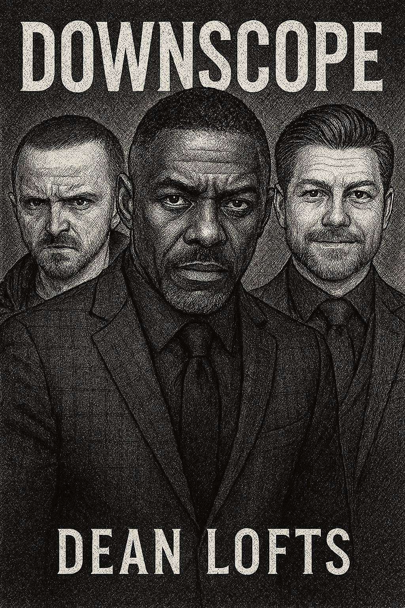

**CHAPTER 3: "THE GREAT DISPERSAL"**

> '"Culture eats strategy for breakfast, lunch, and late-night Jira ticket updates."'
> – Modern variation on Peter Drucker, often muttered by frustrated engineers, 2025

---

## 1. THE EDICT: DELETING THE PHYSICAL LAYER

The email arrived with the dispassionate finality of a `terraform destroy` command executed against the company's physical presence. Tuesday morning, 9:02 AM EST. Precisely scheduled, no doubt, by an HRIS workflow designed by committee and signed off by Legal. Sender: Mark Weaver. Subject: **"INNOVATE SOLUTIONS: OFFICE SPACE REORGANIZATION AND FUTURE OF WORK INITIATIVE."** The subject line itself was a minor masterpiece of corporate obfuscation, hinting at progress while delivering an eviction notice.

Across the distributed network of home offices, makeshift command centers, and the dwindling population inhabiting the increasingly cavernous space at 275 Madison Avenue, 120 employees paused their code compiles, muted their Zoom calls, or stopped mid-Slack-sentence to absorb the decree. Fourteen paragraphs. A dense forest of buzzwords – "agility," "flexibility," "synergy," "dynamic paradigms," "empowering our talent," "optimizing collaborative potential" – surrounding the hard, inescapable kernel buried in Clause 7b, subsection (iii): the Madison Avenue lease was not being renewed. Sixty days to vacate. Innovate Solutions was officially, irrevocably, remote-first.

The collective reaction, filtered through the asynchronous medium of Slack, was a chaotic digital storm. #general instantly became unusable, a firehose of reactions colliding in real-time. The celebratory 🎉 and 🏠 emojis battled the anxious 😟 and 😭 faces. GIFs flew: Homer Simpson backing into a hedge, the "This is Fine" dog engulfed in flames labeled "Team Cohesion," Keanu Reeves dodging bullets labeled "Mandatory Meetings." Beneath the performative reactions, deeper currents stirred – relief, anxiety, resentment, opportunism.

Within the designated territory of the Infrastructure team – the "quiet corner" near the emergency stairwell, an enclave carved out more by shared intensity than physical walls – the response was characteristically muted, analytical. Max Murphy, immersed since dawn in optimizing Aether's vector embedding pipeline performance, absorbed the email without visible reaction. He adjusted the temperature dial on his desktop vaporizer, took a precise, controlled inhalation of high-THC sativa concentrate chosen for cognitive enhancement, and exhaled a near-invisible vapor stream that dissipated into the airflow from the humming server rack nearby.

"Called it," he murmured, more a confirmation of predicted probability than a statement of surprise. He glanced at Eli Patel, who remained laser-focused on a complex visualization of Kafka topic throughput across three monitors. "Q3 OpEx targets were underwater. Real estate was the obvious line item to cut. Zero surprise."

Eli offered a minuscule nod, fingers never ceasing their rhythmic dance across his custom split keyboard. "Predictable outcome. Aligns with industry trends toward distributed workforce models. Reduces non-essential overhead by approximately 4.17 million USD per annum. Primary impact shifts from physical co-location dependency to network latency, asynchronous communication protocols, and individual discipline."

Sarah Kim arrived, navigating the increasingly sparse desks with her daily offering – four perfectly brewed pour-over coffees in insulated travel mugs, sourced from the artisanal shop downstairs, a ritual defiance against the office's sludge-producing machine. "Morning," she greeted, distributing the mugs. "Judging by the shrapnel density in #general, I assume Weaver finally dropped the remote bomb?"

"Affirmative," Max confirmed, accepting his mug with a grateful nod. The coffee was consistently excellent; Sarah's dedication to process extended even to caffeine extraction. "We are now officially phantoms in the digital machine."

"The implications are... significant," Sarah mused, settling into her chair. "On the plus side, no more battles over the thermostat setting. Downside, the ambient server hum in this corner was strangely soothing. And the free, mediocre snacks will be missed. By some."

"Logistical adjustments required," Max stated, already shifting to implementation details. "Secure recurring booking for a large team suite at the downtown WeWork via the corporate enterprise account. Recommend weekly cadence, Fridays, 1000 to 1600 hours baseline. Facilitates high-bandwidth synchronous collaboration for architectural reviews, complex troubleshooting, and essential human psychosocial alignment."

"Keeps us from turning into complete code goblins living solely on Slack and caffeine," Sarah translated. "And allows for post-session 'strategic debriefing' at Pixel Pioneers."

"Barcade attendance is a statistically significant factor in maintaining team morale and preventing burnout during high-intensity phases," Eli added, deadpan. "Cross-referenced analysis of commit velocity versus retro gaming participation confirms correlation."

Max and Sarah exchanged amused glances. Eli's commitment to data-driven justifications for social activities was both absurd and strangely effective.

"Provided," Sarah added, fixing Max with a pointed look, "said retro gaming participation does not involve attempts to remotely trigger production deployments via SSH tunnels established through the bar's unsecured Wi-Fi network. Again."

"That was a controlled experiment to test edge-case failure modes under suboptimal network conditions!" Max protested weakly. "And the rollback script worked perfectly!"

"The rollback script _I_ had to execute remotely at 2 AM while you were arguing with the bartender about the physics of Donkey Kong barrels," Sarah corrected. "Point stands. Keep work and cheap beer separate."

Their banter, a well-worn pattern of technical debate laced with dry humor, was interrupted by the visual drama unfolding across the office floor. Victor Chen, his face a mask of barely suppressed fury, erupted from his office and stormed towards the executive wing, ignoring attempts by his own product managers to intercept him. His trajectory was aimed squarely at Greg Whitman's office.

"Victor clearly wasn't briefed," Max observed, watching the scene with detached interest. "Violation of Law 9: Win through your actions, never through argument. Victor relies on argument and process. Greg bypassed both."

"Creates instability," Sarah noted, tracking Victor's path. "Greg avoids confrontation, lets decisions land, then manages the fallout. Efficient for him, creates ripples of uncertainty elsewhere."

Meanwhile, Derek Miller was performing his signature move: converting bad news into an opportunity for performative enthusiasm. He flitted between the few remaining members of Team Catalyst, painting the office closure as a liberation. "Guys, this is phenomenal! The ultimate flexibility! We can sync from anywhere! Think agile, think global, think... synergistically nomadic!" His energy felt frantic, bordering on desperate, a man clinging to relevance as the physical markers of his authority dissolved. Jules Tucker endured the onslaught with stoic patience, while Connor Wright seemed genuinely swept up in the hype, likely already browsing Airbnb listings in Tulum.

Max's secure phone, resting face down on his desk, emitted a low, discreet vibration. Signal. Rhys. He picked it up, glancing at the encrypted message notification.

**Rhys:** 'Confirming receipt and comprehension of Weaver's announcement. Proceeding with strategic withdrawal as planned. Pre-booked family holiday (Bali, three weeks) commences immediately. Provides necessary observational distance during initial destabilization phase. Aether Phase Two formal kickoff deferred thirty days post-return. Rationale: allows emergent organizational patterns to solidify, provides runway for core team consolidation and hardening of Phase One systems. Utilize this period. Address tech debt. Refine architectures. Solidify documentation. Maintain operational vigilance. Max, command authority delegated. Sarah, coordinate critical escalations. Eli, data integrity paramount. Jules, finalize auth scaling in collaboration with Max. Jesse, support Sarah, absorb everything. Maintain absolute channel security. Report only P0 incidents requiring intervention. Otherwise, operate with discretion and initiative. Trust is placed.'

Max absorbed the layers. Rhys wasn't just taking leave; he was executing a calculated retreat, invoking Law 16. _He trusts us_, Max thought, a flicker of something deeper than just professional respect passing through him. Rhys wouldn't leave Aether adrift without absolute confidence in the instruments left behind, especially Max himself. The pressure was immense, but the implicit trust was stabilizing.

**Max:** 'Acknowledged. Rationale understood. Infra stability maintained. Consolidation phase initiated. Auth scaling (LRFU cache implementation) proceeding per design spec co-authored with Jules. Vector store optimization underway. Monitoring protocols enhanced for distributed environment. Will leverage additional time for comprehensive system hardening and documentation refinement. Line held. Secure channel protocols enforced. Enjoy the strategic detachment. 🍺'

He sent the reply, the beer emoji signifying complete alignment. He then relayed the core information to Sarah and Eli.

"Rhys offline three weeks, Phase Two delayed a month after he's back," he stated quietly.

Sarah nodded, processing instantly. "Gives us runway. Good. Lets Jesse ramp up properly. And gives Jules more time to fully integrate the auth changes without sprint pressure."

"Temporal buffer allows for rigorous testing of complex system interactions under variable load," Eli added. "Reduces probability of unforeseen deployment failures during accelerated Phase Two execution."

"Also means," Sarah mused, a thoughtful expression crossing her face, "Rhys won't be here to directly manage the political fallout from the office closure, or Victor's inevitable counter-moves regarding Aether. Interesting choice."

"He trusts us to handle it," Max stated simply. "Or, more accurately, he trusts the systems and processes we have in place." Including, implicitly, Project Carry Derek, their most critical, entirely undocumented human system mitigation strategy.

The conversation shifted back to immediate tasks – updating deployment schedules, assigning tech debt tickets, planning the first Friday co-location session. As Max immersed himself back in the Aether codebase, mapping out the LRFU cache implementation details, his thoughts briefly snagged again on the image of Emma Layton, sitting isolated by the window, seemingly untouched by the surrounding chaos yet radiating a profound sense of disconnection. He pushed the thought away. Not his problem domain. Focus on the signal, filter the noise. Aether was the priority.

## 2. ECHOES IN THE EMPTY HALL: EMMA'S FRACTURE

The days following the announcement bled into one another, marked primarily by the gradual emptying of the office. Teams organized awkward "farewell to the Keurig" virtual happy hours. Logistical emails about packing personal items and returning company equipment filled inboxes. A slow, pervasive sense of melancholy settled over the digital channels, punctuated by forced corporate cheerleading about the "exciting new era of flexibility."

For Emma Layton, the office closure felt like the final severance. The physical space, however flawed, had been an anchor. It provided structure, routine, a tangible boundary between the consuming demands of work and the increasingly terrifying emptiness of her personal life. Now, that boundary was gone. Her apartment, already feeling like a prison since James and the kids had left, officially became her entire world.

She functioned. That was the word she clung to. 'Functioning.' She woke each morning before dawn, often after only a few hours of fragmented, nightmare-ridden sleep. Showered. Dressed meticulously in professional attire, even though her camera remained perpetually off. Applied makeup with surgical precision, concealing the dark circles, the unhealthy pallor, the faint tremor in her hands. Made coffee. Sat at her desk. Opened her laptop. And worked.

She worked with a ferocious, consuming intensity that astonished her colleagues and pleased her superiors. Her productivity metrics soared. She closed tickets at twice her previous rate. Her documentation was exhaustive, her strategic proposals insightful, her responses to inquiries instantaneous, regardless of the hour. Victor Chen, apparently deciding her public humiliation had served its purpose, began assigning her increasingly complex, high-visibility projects, which she absorbed without comment, delivering results ahead of schedule, exceeding expectations.

It was the only way to keep the static at bay. The relentless focus on Jira boards, Confluence pages, Figma prototypes, data dashboards – it filled the terrifying silence in her head, drowned out the whispers, pushed back the fragmented memories of 'that night'.

'That night.' The memory was a black hole, threatening to pull her in whenever her focus wavered. Flashes persisted: The shrill sound of her own screaming, unrecognizable. The shattering glass – wine bottle? Picture frame? Both? The impossible weight of her children's fear-widened eyes staring up at her. Sophie's small voice, trembling: "Mommy, are you okay? What's wrong with you?" Sophie, older, braver, trying to shield her brother, her face a mask of terrified disbelief. James... his expression wasn't anger, wasn't judgment, just a profound, devastating sadness as he gently guided the children away, closing their bedroom door, leaving Emma alone amidst the wreckage.

She couldn't remember throwing things, couldn't remember hurting herself, though the cuts on her hands, now healing under neat bandages, suggested otherwise. She couldn't remember James cleaning up the mess, couldn't remember him leaving with the kids the next morning, just the note left on the kitchen counter: 'Staying at Mom's for a bit. We need space. Call me when you're ready to talk about getting help.'

Help. The word mocked her. She _was_ getting help – from the bottom of a vodka bottle each night, the only reliable source of temporary oblivion.

And from the strange, dark corners of the internet she found herself exploring during the lost hours between work and unconsciousness. Incognito windows. Tor browser. Search queries she couldn't quite remember typing, yet the browser history, when she dared to look, hinted at disturbing pathways: 'Victor Chen personal information'. 'Employee background check anonymous'. 'Dark web reputation services'. 'Untraceable communication crypto'.

Had she actually contacted anyone? Exchanged messages? Paid in anonymous Monero? The gaps in her memory were terrifying voids, populated by fragmented images of typing furiously, of hovering over 'send' buttons fueled by vodka and rage. Sometimes she'd wake up with a new encrypted messaging app installed on her phone, no recollection of downloading it. Or find a burner email account open in a browser tab. These blackouts, fueled by alcohol and stress, were becoming more frequent, leaving behind unsettling digital breadcrumbs she frantically deleted each morning, desperate to convince herself they were just drunken fantasies, that she hadn't actually crossed an irreparable line. The _not knowing_ was a cold dread pooling in her stomach.

But the rage felt real. The obsession with Victor, the injustice of her situation, the feeling of being utterly powerless – it simmered constantly beneath the surface of her high-functioning facade. And sometimes, late at night, the fantasy of retribution felt less like fantasy and more like... possibility.

Her brief interactions with Jules Tucker were the only cracks in this grim reality. Their weekly virtual coffees, initiated hesitantly by him, had become unexpected points of fragile connection. Jules didn't pry, didn't judge, didn't offer unsolicited advice. He simply talked – about work, about remote life challenges, about Lily's science projects, about the absurdity of Derek Miller. He treated her like a colleague, like a normal person, a reminder of the professional self she was struggling to maintain.

She had even, impulsively, joined one of the Infrastructure team's open collaborative work sessions he'd mentioned. Two hours with her camera on, contributing minimally but 'present', surrounded virtually by the focused energy of Max, Sarah, Eli, and Jules. It had felt... strangely grounding. Real. Afterwards, she'd immediately retreated back into isolation, overwhelmed by the effort, but the memory lingered – a flicker of connection in the overwhelming darkness.

Jules pinged her on a Thursday afternoon.

**Jules Tucker:** 'Hey Emma, quick question re: the user segmentation logic for the churn prediction model. Mind if I grab 5 mins?'

Emma hesitated. Her instinct was to deflect, claim she was busy, handle it asynchronously. But the memory of their last coffee chat, the brief feeling of normalcy, nudged her towards acceptance.

**Emma Layton:** 'Sure, can talk now if you're free. Zoom or call?'

**Jules Tucker:** 'Zoom works. Sending link.'

She joined the call, forcing her features into a neutral expression. Jules appeared instantly, his familiar home office bookshelf behind him.

"Thanks for the quick response," he began. "Working on integrating some Aether-derived risk scores into the existing churn model, and hit a question about how the enterprise user segments are defined. The Confluence docs seem slightly out of date."

Emma leaned forward, professional instincts kicking in automatically. "Ah, yes. That documentation hasn't been updated since the Q2 realignment. The current segmentation logic uses a combination of ARR, contract duration, and product module adoption intensity. Let me pull up the current definition..."

For the next fifteen minutes, they dove deep into the technical specifics. Emma walked Jules through the complex business logic, explaining the nuances of different customer tiers, the weighting factors used, the historical reasons for certain thresholds. Her knowledge was encyclopedic, her explanations precise. Jules listened intently, asking clarifying questions, translating her business logic into potential implementation patterns for Aether.

"This is incredibly helpful, Emma," Jules said finally, looking genuinely impressed. "This level of detail isn't captured anywhere in the official docs. You just saved me hours, possibly days, of reverse-engineering."

"Happy to help," Emma replied, feeling a faint, unfamiliar warmth – professional pride? – stir within her. "It's important the models use accurate segmentation, otherwise the predictions become meaningless."

"Exactly," Jules agreed. "Which raises another question... Victor's been pushing back hard on allowing Aether direct access to the underlying Salesforce data for segmentation, citing governance concerns. Your explanation makes it clear why direct access is actually _necessary_ for accuracy, given how complex the logic is."

Emma considered this. Victor's obstructionism was predictable. But Jules was right – relying on outdated or simplified segments exported to the data warehouse would compromise Aether's effectiveness.

"The governance concerns are partially legitimate," Emma offered carefully, navigating the political minefield. "Direct Salesforce access requires careful handling of PII and contractual obligations. But it's solvable through appropriate technical controls – data masking, field-level permissions, audited access pathways. Your authentication system already provides the foundation for that, right?"

"It does," Jules confirmed, nodding slowly, clearly processing the implications. "We can generate credentials with policies scoped specifically to the required Salesforce objects and fields, with full audit trails."

"Then the argument shifts from 'if' to 'how'," Emma concluded. "If you can demonstrate technically robust controls that satisfy SecOps and Legal requirements, Victor's objections become purely political, harder to sustain."

Jules looked thoughtful. "That's... a very useful perspective. Framing it as a technical solution to a legitimate governance challenge, rather than just an interdepartmental turf war."

"Sometimes," Emma said, a flicker of her old strategic insight returning, "the best way to win a political battle is to make it about technical implementation details. Harder for non-technical stakeholders to argue against."

A shared smile passed between them, an acknowledgment of the corporate games they both understood.

"Thanks, Emma," Jules said again, his appreciation seeming genuine. "This helps immensely. Both technically and... strategically."

"Anytime," Emma replied, feeling slightly lighter than she had moments before. The brief collaborative session, the successful problem-solving, the shared understanding – it was a reminder of the aspects of her job she genuinely enjoyed, aspects almost entirely absent in her recent interactions.

After the call ended, Emma stared at her screen for a moment. Maybe... maybe she could join that collaborative work session again next week. Maybe talking shop, focusing on solvable technical problems, was a healthier distraction than... other things.

Her phone buzzed. A text from James. 'Kids had fun today. Sophie asked when you could visit her terrarium.'

Emma closed her eyes, took a deep breath. One step at a time. Maybe recovery wasn't impossible. Maybe the person she used to be wasn't entirely gone. The thought was terrifying, fragile, but undeniably present.

## 3. THE REMOTE CALIBRATION

Jules Tucker stared at his kitchen calendar with a mixture of resignation and mathematical determination. The faded SpaceX rocket ships, selected by Lily during their annual calendar shopping ritual, framed a month rapidly filling with digital and physical commitments. He scribbled "WeWork Friday, 10-4" in the last empty square, then stepped back to assess the Tetris game his schedule had become.

The transition to full remote work had been surprisingly smooth from a technical perspective. His home setup was already optimized from the pandemic years, his routines established. The real challenge wasn't bandwidth or ergonomics; it was the invisible wall now firmly erected between his work life and any semblance of spontaneous human connection.

He glanced at the clock. 7:13 AM. Lily wouldn't be up for another forty minutes. He opened his laptop and scanned the overnight Slack messages. Derek had already been active since 5:30 AM, a flurry of enthusiastic but largely content-free messages peppering various channels, punctuated with his signature excess of exclamation points.

```
Derek Miller: AMAZING call with Greg yesterday about Catalyst alignment with Aether! Tremendous opportunity space opening up! AI-driven excellence coming FAST! Team sync moved to 9:30 today to accommodate some priority discussions! Bring your innovation hats! 🧠💡🚀
```

Jules sighed, mentally adjusting his morning schedule. Derek's random meeting time changes had become even more frequent since the office closure, as if the absence of physical constraints had eliminated his last tether to consistency.

A more interesting notification caught his eye: a direct message from Max Murphy, timestamped 3:24 AM.

```
Max Murphy: Authorization caching proposal looks solid. Clean implementation, minimal surface area, appropriate error handling. PR approved. One suggestion: line 147, consider defensive null check before accessing token.claims. Shouldn't trigger in practice but better safe than sorry. Other than that, good to merge. Let me know when deployment to staging complete. Ready to test against the RAG pipeline.
```

The message, though terse, carried a subtle shift in tone that Jules had been noticing more frequently. Not exactly warmth, Max didn't do warmth, but a baseline of professional respect that had been notably absent before the hackathon. The approved PR represented another small integration point between Jules's authentication work and Aether's core systems, another thread binding him to the project that had once excluded him.

Jules typed a quick acknowledgment, promising to add the defensive check and deploy to staging before lunch. As he reviewed his own code, adding the suggested improvement, he reflected on his gradual migration into the Aether orbit. Since Rhys's departure for Bali three weeks ago, the boundaries between Team Catalyst and Infrastructure had blurred slightly, at least for Jules. With Derek occupied by what he called "strategic alignment activities" (which seemed to consist primarily of attending meetings where he had no substantive contribution), Jules had found himself spending an increasing percentage of his bandwidth on Aether-related work.

The auth system that had initially earned him recognition was now his primary focus, evolving from a hackathon utility into a critical security component. The LRFU cache implementation he and Max had co-designed had proven its value, dramatically reducing authorization latency for Aether's increasingly complex RAG pipeline. The direct collaboration with Max, while still somewhat formal, had developed its own efficient rhythm.

His laptop pinged with a calendar notification: "Lily - Science Project Support (Frogs!!!) - 7:30 PM." Jules smiled, remembering his daughter's excitement about the upcoming class terrarium. The firm boundary he maintained around evening family time had initially seemed like it might conflict with Infrastructure's notorious intensity. But to his surprise, Max and Sarah had adapted to his constraints with minimal friction, scheduling collaborative sessions during his available hours, respecting his off-limits blocks. It wasn't accommodation so much as pragmatic resource management; they valued his technical contribution enough to work around the edges.

The compromise worked. Jules delivered his technical commits, maintained his core responsibilities to Team Catalyst, and still managed to be present for bedtime stories and science project building. The feared pressure to match Max's chemically-assisted coding marathons had never materialized. Instead, a strange equilibrium had formed, his consistent, reliable output balancing Max's periodic bursts of hyper-productivity.

The arrangement wasn't official; his reporting line still ran through Derek to Victor. But functionally, he was spending at least 60% of his time on Aether-related development. Derek, either oblivious or strategically unconcerned, seemed happy to claim credit for "supporting cross-functional alignment" while Jules quietly expanded his footprint on the company's highest-priority project.

Another Slack notification pinged: Sarah Kim, this time in the #aether-auth-team channel. (Note: This channel name might evolve as Jules integrates fully).

```
Sarah Kim: Morning all. First remote WeWork co-working session confirmed for this Friday, 10:00-16:00, downtown location. Conference Room Eagle booked. Planning to focus on finalizing the MCP integration patterns and auth flow documentation. Jules, if you can make it, having your auth expertise in person would be valuable. Usual post-session Pixel Pioneers debrief will commence at 16:30 for those interested. RSVP in thread.
```

Jules hesitated briefly before responding. A full Friday in person would require arranging backup childcare if Lily's school let out early as scheduled. But the chance for in-person collaboration, the rare opportunity to work side by side rather than through the limiting portal of Zoom, was tempting. The mention of Pixel Pioneers, Infrastructure's ritual post-work barcade sessions, was particularly intriguing. He'd never been invited before.

```
Jules Tucker: I'll be there. Can probably stay for part of Pixel Pioneers afterward, but need to be home by 19:00 at the latest. Looking forward to finalizing the MCP integration in person.
```

He added "Arrange backup sitter" to his to-do list just as the sound of small feet padding down the hallway announced Lily's awakening. The dual-track nature of his life reasserted itself, engineer and father, problem-solver in parallel domains.

"Daddy, can frogs eat cucumber?" Lily's voice called out, already focused on her upcoming science project.

"Let's look it up together after breakfast," Jules replied, closing his laptop. The authentication edge cases would wait; right now, amphibian dietary requirements took priority.

## 4. DIGITAL DECOMPOSITION: VICTOR'S COUNTERATTACK

Victor Chen's home office was a testament to precise control. The gleaming glass desk held dual monitors positioned at exactly 90-degree angles to his ergonomic chair. A row of productivity and management books, arranged by height, lined the custom-built shelf behind him, a carefully curated backdrop for video calls. The lighting was perfect, diffused through expensive filters that eliminated shadows and softened his features for the camera. Everything in its place, everything serving a purpose.

Which made the scattered papers, empty coffee cups, and uncharacteristically disheveled appearance all the more striking to the small group assembled on his private Zoom call. Victor's normally impeccable hair showed signs of repeated agitated finger-combing. His eyes darted constantly to notifications appearing on his second monitor.

"Unacceptable," he stated flatly, his voice tightly controlled despite his appearance. "Completely unacceptable. Rhys vanishes to Bali, conveniently timed with the office closure announcement, and suddenly Infrastructure operates as if normal organizational boundaries simply don't exist?"

The participants, Emma Layton, Derek Miller, and Connor Wright, maintained careful neutral expressions. This was the third "emergency alignment session" Victor had called in two weeks, each one more focused on Infrastructure's perceived territorial expansion than any actual product development.

"The evidence is undeniable," Victor continued, sharing his screen to display a complex diagram charting commit activity. "Look at the pattern of Git commits, pull requests, and Slack activity. Infrastructure is systematically absorbing key technical resources. Jules Tucker's activity on Aether-related repositories has increased 340% since Rhys's departure, despite no formal resource allocation approval through my office."

Emma watched the presentation with a growing sense of disconnection. Victor's obsession with organizational boundaries and approval workflows felt increasingly divorced from the actual work being done. Aether was delivering tangible value, evolving rapidly. Its RAG pipeline had already identified three major enterprise accounts at risk of churn that conventional analytics had missed entirely. Yet Victor seemed fixated on procedural violations instead of results.

"Derek," Victor said sharply, "Jules reports to you. Why is he spending over 60% of his time on Aether integration work without proper resource allocation approval?"

Derek shifted uncomfortably, his usual enthusiasm dampened by Victor's tone. "Well, Victor, there's been tremendous synergy potential with the auth system Jules developed. Max and Sarah have been leveraging his expertise for critical security components while maintaining his core deliverables for Catalyst. It's actually a win-win cross-functional alignment that..."

"That bypasses proper chain of command and established resource allocation protocols," Victor interrupted, his voice clipped. "This is exactly how Infrastructure operates. They identify a technical dependency, establish direct relationships with key developers, and gradually pull them into their orbit without formal approval. Before you know it, the developer is effectively reporting to Rhys rather than their actual manager."

Emma found herself unexpectedly annoyed by Victor's framing. "With respect," she said, surprising herself by speaking up, "from a product perspective, the technical integration work Jules is doing serves our overall goals. The authentication system is a critical enabler for secure cross-system data access, which directly supports the customer insight capabilities we've been trying to build for three quarters."

Victor fixed her with a cold stare. "Emma, I would have expected _you_ of all people to recognize the dangers of Infrastructure's 'expand and conquer' approach." The words carried a subtle sting, a reminder of her LinkedIn post debacle and the internal fallout. "This isn't about technical merit; it's about governance and control. If we allow Rhys and his team to selectively extract key developers from other teams without going through proper channels, we undermine the entire organizational structure."

Emma felt herself retreating back into the protective shell she'd constructed. "Of course," she murmured. "I was just considering the technical dependencies."

"The technical dependencies should be managed through proper interfaces and service boundaries, not by poaching developers," Victor replied curtly. He turned his attention back to Derek. "I need you to rein this in. Immediately. Jules's allocation to Aether work should be formally tracked, approved, and limited to no more than 30% of his capacity. I want a comprehensive audit of his current contributions and a transition plan to reduce Infrastructure dependencies on his direct involvement."

Derek nodded vigorously, clearly relieved to have a concrete action item. "Absolutely, Victor. I'll coordinate with Jules to formalize the allocation and ensure proper boundaries. Should I reach out to Max directly or..."

"No," Victor interrupted again. "I'll handle Infrastructure. You manage your team member. And Connor," he added, turning to the junior engineer who had remained silent, "I want you to start shadowing Jules on the authentication system. Learn the codebase, understand the integration points. We need to reduce our technical dependency on a single developer."

Connor's eyes widened slightly. "Sure thing, Victor. I can definitely start ramping up on... uh, authentication systems and security protocols and..." His voice trailed off as the technical complexity he was being volunteered for began to sink in.

Emma watched the dynamic unfold with a mixture of detachment and dismay. Victor was technically correct about proper resource allocation, but his approach felt counterproductive, driven more by wounded pride than strategic thinking. Jules had found a project where his skills were valued; now Victor was threatening to disrupt that purely for organizational politics.

"One more thing," Victor added, his tone hardening. "I've submitted a formal request to Greg for read access to the Aether core repository and the private Slack channels. As Head of Product, I require visibility. Sarah Kim has been stonewalling the request for two weeks, citing 'security hardening' and 'limited access protocols.' Completely unacceptable."

Emma recognized the personal edge beneath the professional justification. This wasn't just about organizational boundaries; it was about Victor being excluded, a perceived loss of status as Aether grew in importance. His pride couldn't bear being denied access.

"I expect all of you to maintain strict documentation of any Aether-related requests or interactions," Victor continued. "Log everything in Jira with appropriate time tracking. If Infrastructure wants resources from Product teams, they can go through proper channels like everyone else. We are not their personal talent pool to raid at will."

The meeting ended with Victor assigning action items and scheduling yet another "alignment session." As Emma closed the Zoom window, she felt a familiar weariness. The territorial battles, the political maneuvering, the endless documentation of process over value—it all felt increasingly pointless.

She opened her personal calendar, staring at the empty squares representing evenings and weekends. James had texted again about the kids potentially visiting, but she'd deflected, claiming work deadlines. The truth was more frightening: she wasn't sure she trusted herself around them yet. Their terrified faces from _that night_ still haunted her dreams.

Her gaze drifted to the vodka bottle on her kitchen counter. Not yet 11 AM, but the craving whispered promises of temporary relief. She forced her attention back to her screen, pulling up the week's deliverables. Work was the lifeline, the one area where she still maintained control, where she still _functioned_. Focus hard enough, work intensely enough, maybe the shadows would stay at bay for another day.

## 5. PIXELATED SANCTUARY: THE INFRA OFFLINE PROTOCOL

Pixel Pioneers was less a bar, more a time capsule lined with glowing screens and saturated with the synthesized soundtracks of a bygone era. The air hung thick with the nostalgic perfume of stale popcorn, spilled beer, and the faint electrical ozone tang emanating from rows of vintage arcade cabinets. On a Friday evening, three weeks after Innovate Solutions had officially shed its physical skin, the core Infrastructure team claimed their usual territory: a slightly sticky high-top table strategically positioned between a four-player TMNT machine and the holy grail – an original Super Nintendo hooked up to a chunky, perfectly calibrated CRT television.

Max Murphy, already nursing his second pint of a hazy IPA, surveyed the Mario Kart character select screen with the intensity of a general planning a campaign. Eli Patel, demonstrating his typical economy of motion, had instantly locked in Yoshi. Sarah Kim, radiating focused competitive energy, hovered over Princess Peach.

"Alright, standard rules," Max declared, selecting Bowser with a decisive click. "Special Cup, 150cc. Loser buys the next round and has to submit a genuinely positive, non-sarcastic comment on Derek's latest 'Quantum-Resistant Zero-Trust Service Mesh' proposal document in Confluence."

Eli physically winced. "That constitutes cruel and unusual punishment under the Geneva Conventions. I'll just buy the round."

"Cowardice," Sarah scoffed, locking in Peach. "True engineers embrace deterministic outcomes based on performance metrics. And besides," she added, cracking her knuckles, "neither of you are winning anyway."

The familiar strains of the Mario Kart theme filled the air as the first race began. Koopa Troopa Beach. Max immediately took the lead with a perfect boost start, only to be instantly taken out by a red shell Eli had somehow acquired within five seconds.

"Seriously, Eli?" Max complained, watching his character spin helplessly. "Already?"

"Optimal item acquisition strategy involves targeting lead player early to maximize disruption potential," Eli replied calmly, drifting smoothly into first place.

"Translation: he's a ruthless bastard," Sarah clarified, boosting past Max with a well-aimed green shell.

The four races unfolded with their usual blend of high-skill driving, strategic item deployment, chaotic luck, and incessant, technically precise trash talk. They navigated Choco Mountain, dodged Thwomps in Bowser's Castle, executed perfect shortcut jumps on Mario Raceway, and endured the psychedelic nightmare of Rainbow Road. Their movements were synchronized, almost telepathic, anticipating lines, blocking shells, dropping peels. It was less a casual game, more a high-speed simulation of managing complex systems under pressure.

They swept the podium – Sarah first after a dramatic final-second lightning bolt dodge, Eli second, Max a disgruntled third after being blue-shelled meters from the finish. A nearby group groaned collectively.

"Again?" one called out. "Do you guys professionally practice Mario Kart?"

"We're Site Reliability Engineers," Sarah called back cheerfully, collecting her drink token. "Maintaining low-latency, high-availability performance under adverse conditions is our job description. This is just... cross-training."

Back at their table, fresh pints secured (Eli graciously covering the round, citing the psychological cost of complimenting Derek), the conversation shifted seamlessly from racing lines to distributed systems.

"The deadlock issue in the Aether feedback processing queue," Eli began, pulling up metrics on his phone, "appears related to Redis cache contention during high-volume sentiment analysis. Need distributed locking or cache partitioning."

"Distributed lock," Max said immediately. "Redis's `SETNX` with a sensible TTL? Simple."

"Potential for race conditions," Sarah countered, sketching on a napkin. "Need robust error handling. Maybe optimistic locking with versioning at the data layer?"

"Adds complexity," Eli mused. "Trade-off between locking overhead and consistency. Need to analyze projected Phase Two load."

"I'll spin up a simulation tomorrow," Max volunteered. "Model both, compare performance."

"Speaking of tooling," Sarah said, changing tack, "did you see ThePrimeagen's latest Neovim config walkthrough? Forty-five minutes arguing about status line placement."

Max groaned. "Don't get me started. Eli keeps trying to convert me to his minimalist Lua setup. I need my plugins! Telescope, Harpoon, LSP Zero... extensions of my nervous system."

"Bloat," Eli stated simply. "Reduces startup time, increases cognitive load. Core Vim motions plus essential LSP provide superior efficiency."

"See?" Max appealed to Sarah. "Keyboard fundamentalist. Probably still uses `hjkl`."

"Naturally," Eli confirmed without irony.

"You are both terrifyingly nerdy," Sarah declared, taking a large gulp of her IPA. "I use VS Code with the Vim plugin disabled, like a well-adjusted human being."

A horrified silence fell over Max and Eli.

"Sarah," Max said slowly, leaning forward conspiratorially, "have you tried Cursor lately? The AI 'Edit in Place'? Point it at legacy code, tell it 'refactor this'... it's like magic."

"Until it confidently introduces a subtle off-by-one error that takes six hours to debug," Sarah retorted. "I trust my own skills over a probabilistic parrot. Though," she conceded, "that Windsurf tool Eli showed me, generating architecture diagrams from Terraform state? That looked useful."

"Windsurf's static analysis is impressive," Eli agreed. "Valuable insights into complex infrastructure dependencies. Reduces risk."

"AI tools are force multipliers," Max argued. "Ignoring them is like insisting on assembly. Adapt or become obsolete."

"Difference between leveraging tools and blindly trusting them," Sarah countered. "Especially black boxes. Remember Copilot suggesting that deprecated crypto library?"

"User error," Max repeated his mantra. "Prompt needed more context."

Feeling the familiar rhythm, Max reached into his jacket pocket unconsciously. Pulled out a slim joint. Brought it to his lips. Flicked the lighter...

"MAX!" Sarah's sharp hiss cut through the haze.

He looked up, startled, joint between his fingers. Saw Sarah's warning glare, Eli's raised eyebrow, and the bartender bearing down on them.

"Right," Max muttered, quickly extinguishing the joint under the table edge. "Context switch failure."

"I _warned_ you!" the bartender growled, pointing a stern finger. "That's twice! One more time and you three are out! Permanently! Take it outside or don't do it!"

"Sorry! Really sorry, man," Max said quickly, hands up in mock surrender. "Completely spaced. Won't happen again."

The bartender glowered, then stalked away.

"Seriously, dude?" Sarah hissed. "Trying to get us banned from the only decent barcade?"

"My bad," Max repeated sheepishly, tucking the joint away. "Environmental awareness module needs recalibrating."

"Perhaps reduce THC intake during social interactions requiring adherence to public norms?" Eli suggested helpfully.

"Perhaps," Max conceded, taking a pointed sip of beer. "Or perhaps society needs to chill."

"Maybe start with not smoking indoors in a licensed establishment?" Sarah suggested dryly.

"Details," Max waved dismissively, though a flush of annoyance at his own carelessness rose. Control slips bothered him.

They fell into comfortable silence, watching nearby screens. The ritual – games, technical debates, banter, occasional near-misses – was their anchor. It was where they recalibrated, reinforced bonds, reminded themselves they were a team.

"Saw Jules is co-author on your auth caching design doc," Sarah remarked eventually. "Good move. Deserves credit."

Max nodded. "His initial STS wrapper was solid. Elegant. Better than mine under hackathon pressure. Caching builds on that. Co-authorship appropriate."

"He's integrating well," Eli observed. "Methodical. Clarifying questions. Respects protocols. Minimal friction."

"And managing the remote balance okay," Sarah added. "Saw him online late on the cache, but clear about signing off for family. Not trying to match your insane 'always-on' mode, Max."

"Good," Max said, genuinely. "Not everyone needs peak intensity constantly. Sustainable contribution is more valuable. Rhys understands that, mostly." He thought briefly of his own chemical support for _his_ peaks. Sustainability looked different for everyone.

"Speaking of sustainability," Sarah said, tone shifting slightly, "Emma Layton actually joined the open collab session this week. Briefly. Camera on."

Max looked up, surprised. "Really? How was she?"

"Quiet," Sarah reported. "Professional. Asked insightful questions about the API gateway, then signed off after an hour. Said she had another deadline." She paused. "Looked like hell warmed over, though. Like she hadn't slept."

"Metrics align," Eli noted, pulling up Rhys's private dashboard he'd discreetly accessed. "Sustained output 140-160% above baseline, minimal communication spikes, negative sentiment correlation increasing."

"Shit," Max muttered, the data painting a clearer, worrying picture. "Burning the candle at both ends and through the middle."

"And no one seems to be intervening," Sarah added quietly. "Victor's just piling more work on her. Greg's oblivious. HR's focused on remote logistics."

"Not our domain," Max said automatically, Infra instinct kicking in.

"Isn't it?" Sarah countered, looking directly at him. "Rhys's mantra? 'Everything is part of the system.' Human components fail too, Max. Sometimes spectacularly. Impacts everyone downstream."

Max met her gaze, recognizing the truth. He'd seen projects fail due to human burnout, not just bugs. Emma's trajectory wasn't just personal; it was operational risk.

"I don't know," Sarah admitted. "Direct intervention feels risky. Doing nothing feels... wrong."

"Subtle, indirect support," Eli suggested. "Keep collaborative channels open, welcoming. Acknowledge contributions publicly. Reduce friction."

"Jules has that coffee chat cadence," Max remembered. "Reinforce its value? Encourage him to keep the channel open, no pressure?"

"Good idea," Sarah agreed. "Low-key, supportive. Maintaining a human connection point."

They lapsed into thoughtful silence again, the weight of Emma's unseen struggle momentarily overshadowing their banter. The system's interconnectedness – technical and human – was increasingly apparent in the isolating remote landscape.

"Right," Max said finally, pushing heavy thoughts aside. "Enough existential dread. Who's up for losing to Eli at Street Fighter?"

"Pass," Sarah declined. "His Zangief piledriver timing is inhuman."

"Statistical probability analysis allows for optimized counter-maneuvers," Eli explained matter-of-factly.

"See?" Sarah shuddered. "Terrifying."

Max laughed, standing. "Fine. More tokens for me. Eli, you owe me a match. Loser debugs Derek's next commit."

"Unacceptable stakes," Eli replied instantly. "I concede."

Shared laughter broke the tension. They finished drinks, gathered belongings, headed into the cool Brooklyn night. The camaraderie felt essential, a counterbalance to their demanding, often isolating work. Max felt grateful for this team—their shared understanding, brutal honesty, unwavering competence. They were Infra. They held the line. In the fracturing world of Innovate Solutions, that felt increasingly important.

## 6. EMMA: ACCELERATION INTO THE VOID

The apartment became Emma Layton's world, her cage, her bunker. The sixty days following the office closure announcement weren't a transition; they were a descent. The physical walls dissolved, replaced by digital ones constructed from Jira tickets, Confluence pages, Figma prototypes, and the relentless hum of her laptop. Remote-first meant no escape. No commute to decompress. No hallway conversations. No boundary between work's demands and the terrifying emptiness of her personal life—an emptiness acutely felt since James and the kids had gone.

She worked. God, how she worked. Her productivity metrics went supernova. She absorbed tasks like a black hole. Victor Chen, perhaps sensing vulnerability or simply exploiting her inexplicable capacity, piled on responsibilities. Roadmap refinements. Competitive teardowns. User journey mapping. Executive dashboards. Emma took it all, delivered it all. Flawlessly. Ahead of schedule. Her Slack status perpetually green, email responses in minutes, Jira velocity charts near-vertical.

A legend whispered in virtual channels – "Did you see Emma's latest spec?" "How does she ship so fast?" "Is she human?" They saw the output, the relentless efficiency. They didn't see the cost.

They didn't see the pyramid of empty wine bottles transitioning to vodka. The untouched salads replaced by coffee, crackers, 3 AM cereal binges. The tremor hidden by the perpetually off camera, the voice meticulously modulated. The dark circles concealed by robotic makeup application.

They didn't see the nights. The endless, silent nights after work stopped and the static returned, whispering doubts, replaying failures. Victor's dismissive tone. Hacker News comments. Pitying glances. James's quiet departure—the note on the counter burned into her memory. Sophie's terrified eyes—an image that ambushed her in sleep and waking hours alike.

Alcohol helped. For a while. Blurred edges, slowed thoughts, offered fuzzy oblivion. But the dosage kept increasing. Glass to bottle. Wine to vodka. Blackouts started subtly – lost time, hazy recollections, waking on the couch unsure how she got there.

Then came Thursday night. James had texted earlier, canceling the planned weekend visit – Sophie had a cold, he'd said, but Emma heard the unspoken: _'It's still not safe. You're still not safe.'_ Rejection festered, a familiar poison. She started drinking earlier, faster, the cheap vodka burning a familiar path down her throat, seeking not numbness, but annihilation.

By midnight, she was adrift, submerged in alcohol and viscous self-loathing. The apartment felt claustrophobic, the silence amplifying the frantic buzzing in her head. It was terrifyingly empty, yet suffocatingly full of ghosts. Shadows writhed in her peripheral vision. The refrigerator hummed a low, mocking tune. Victor's face smirked up from the floorboards. Rhys's cold, assessing voice seemed to whisper from the heating vents.

Paranoia flared, hot and sharp, fueled by the liquor. _They were watching_. Through the webcam's dead eye, the smart speaker's silent microphone, maybe even through the walls. _They knew_. Knew she was broken, failing, utterly falling apart.

She stumbled towards the bathroom mirror, needing to see... confirmation? Reassurance? The reflection swam into focus, and it wasn't her. Not the functioning professional she projected. It was gaunt, haunted, eyes wide with a primal terror. Unwashed hair clung to her scalp. A dark stain marred her shirt – spilled coffee? Wine? Blood? Was this _now_, or was it the face from _that night_ staring back?

_'Monster.'_

The word echoed, seeming to come from the reflection itself, or perhaps just the static in her own mind.

A scream tore from her throat, high-pitched, jagged, devoid of humanity. Not a cry for help; the sound of pure fracture ripping through the silence of the empty apartment.

Her fists pounded the cold glass, desperate to shatter the horrifying image staring back. "NOT ME! THAT'S NOT ME!" The glass held firm, her distorted face mocking her impotence.

Blind rage surged, directionless, fueled by the vodka and the encroaching memory. She spun away, a stumbling whirlwind colliding with furniture. Work papers scattered. A framed photo – James and the kids, smiling, from before – was knocked from a side table, the glass cracking on the hardwood floor. The sound, sharp and final, momentarily pierced the internal static. _Her hands remembered smashing frames, tearing photos... Had she just knocked this one over, or was that just the echo?_

She lurched into the living room, lost in the swirling chaos of the past overlaying the present. Cushions were swiped at, one tumbling to the floor. Books on the shelf seemed to blur, spines threatening to break under phantom pressure. A floor lamp wobbled precariously as she brushed past. _Need to make it stop. Need to break it. All of it._ The remembered impulse was overpowering.

Stumbling into the kitchen, she yanked open a drawer, the clatter of silverware loud in the silence. Her hand brushed against something cold and sharp – a paring knife left out from a failed attempt at making lunch earlier. She gripped it, the cold metal a strange, anchoring weight in her trembling hand. _The memory of the knife, the blood from that night..._ Not for anyone else. Never. But the sharp edge against her own skin… maybe _that_ would stop the internal noise? A different pain? A real pain _now_?

Almost experimentally, she pressed the tip against the skin of her forearm, harder than she'd intended. A bead of blood welled, startlingly bright. A sharp, grounding sting. _Real_. Unlike the swirling ghosts and echoing screams in her head.

_'Yes. This helps.'_

With a choked sob, she dragged the blade sideways. Not deep, but enough. Blood flowed, dripping onto the floor, mixing with dust motes. She stared, fascinated, mesmerized by the simple, physical reality of it amidst the mental chaos.

_"Mommy?"_

A small voice echoed in the vodka fog – Sophie's voice, small, terrified, _from that night_. It wasn't real. It couldn't be. They weren't here. _But the image burned behind her eyes: Sophie frozen in the doorway, clutching her rabbit... Ben pale, trembling behind her..._ Their remembered fear, a phantom weight crushing the air from her lungs. They weren’t accusers now, just spectral witnesses to her ongoing disintegration.

"WHAT?" The snarl ripped from her throat _now_, directed at the empty space where the phantoms flickered. She spun, the bloody knife clutched loosely, forgotten. Her posture feral, coiled by memory and present despair. "What do you want? Come watch the monster fall apart _again_? Tell me how I've failed?"

The innocent question from the memory detonated her remaining control. _"M-mommy,"_ the phantom Sophie stammered, tears streaming, _"y-you're bleeding. Are you okay? What's wrong with you?"_

"WRONG WITH ME?" she shrieked into the empty apartment, the sound ragged, inhuman. "EVERYTHING IS WRONG! HE TOOK EVERYTHING! THEY ALL WATCHED! YOU THINK THIS IS MY FAULT?!"

She lunged forward, not _at_ anything tangible, but into the space filled with ghosts, hands clawing the air. "GET OUT! LEAVE ME ALONE! I HATE YOU! I WISH YOU WERE NEVER BORN! I WISH I WAS DEAD!" The remembered words tore out of her, poisoning the present air.

She stumbled, tripped over an ottoman, and crashed heavily to the floor. The impact knocked the wind out of her, momentarily silencing the screams, leaving her gasping amidst the minor disarray of her current breakdown – the knocked-over photo, the fallen cushion, the blood on her arm.

_And the memory of James, his terrifying calm arriving in the wreckage of that night... Assessing, acting, cleaning..._ No one was coming now. He wasn't there. He'd taken them. Left her alone in the aftermath _he'd tidied last time_. The silence now was absolute, crushing, unbroken by footsteps or quiet commands. She was truly alone in the wreckage, both past and present. Monster had won.

Exhaustion, heavy and final, dragged her down into a dark, dreamless void on the living room floor.

The following morning, she woke slowly, sunlight painfully bright through the window. Her head throbbed viciously. Her bandaged hand from the _original_ incident ached, and now her forearm stung beneath a makeshift bandage of paper towels crudely taped during the blackout. The apartment was eerily quiet.

Memory returned: brutal, fragmented flashes not just of _that_ night, but of _last_ night’s reliving. The screaming into the void. The mirror. The knife _now_. The phantom children. The fall.

Nausea surged, acidic, shaming. Stumbled upright, surveyed the apartment. Not the total devastation of _that night_ James had cleaned. Just the signs of _her_ solitary unravelling: the cracked photo frame on the floor, the displaced cushion, the faint smear of blood near where she'd woken, the paring knife sitting starkly on the kitchen counter, wiped clean – had she done that? She couldn’t remember. The empty vodka bottle lay accusingly on its side. The heavy silence remained, damning evidence of her isolation.

_'Function.'_ The thought surfaced, automatic, desperate. _'Perform.'_

She showered, the hot water scalding but grounding. Dressed sharply – silk blouse, tailored blazer (sweatpants below, hidden from the webcam). Applied makeup like a battlefield surgeon, concealing the physical traces of tears, exhaustion, and despair. Re-bandaged her forearm neatly, pulling the blazer sleeve down to cover it. Made coffee, strong, black.

Sat at her desk, 8:58 AM. Logged into Slack. Status: Active. The green dot glowed, a tiny lie in a sea of digital performance.

A calendar pinged. 9:00 AM. Product Strategy Sync. Clicked the Zoom link. Composed her face into a mask of professional engagement.

"Morning, all," she greeted, voice remarkably steady, perhaps only a fraction too brittle.

Victor Chen nodded curtly on screen. "Emma. Good. Walk us through the revised Q4 roadmap based on the CEO's remote-first directive."

Emma shared her screen, a complex Gantt chart appearing. "Certainly, Victor. As you can see, the primary impact of the remote transition is on cross-team collaboration velocity..."

She delivered the analysis flawlessly. Crisp, data-driven, astute. Answered questions calmly, deflected politics neutrally. No one commented on the slight tremor in her voice or the way she kept her left arm rigidly still, if they noticed at all. Performing Emma Layton, High-Potential Product Manager. An Oscar-worthy performance built on sheer will and terror.

Inside, she felt nothing but a vast, cold emptiness. The dissociation was almost comforting, a shield against the memory of the night before and the crushing weight of her reality.

Later, an email from James arrived. Subject: Therapist Recommendations. Opened it numbly. Three names, numbers, emails. Crisis recovery, addiction, trauma specialists. Stared, words blurring. His words from the _original_ note echoed: _'Call me when you're ready to talk about getting help.'_ Taking that step felt impossible, admitting the monster was real, admitting she couldn't fix this herself.

Her gaze drifted to her browser history, still open from some point during last night's spiral. A dark web forum link. A cached page title: '#HRTerminationSpecialist'. Had she just looked? Or interacted? Typed something? Sent a message? The memory was slippery, indistinct, lost in the vodka haze and the relived trauma. Fragmented recollections of typing furiously, hovering over a 'send' button, fueled by rage and despair. There was no certainty. The _not knowing_ what she might have done during the blackout was a cold dread pooling in her stomach. Had she crossed a line she couldn't uncross?

With trembling fingers, she cleared the history, deleted the Tor browser icon from her desktop, scrubbed the digital traces she could find. _'Just a thought. Drunken fantasy. Never happened.'_ She repeated it like a mantra, desperate to believe it, terrified that it wasn't true.

Needed work. Work was safe. Controllable. Predictable.

Opened Jira, found the highest priority ticket assigned by Victor. Plunged back into the comforting complexity of product specs, user stories, data models. _Function. Perform. Deliver. Survive._ It was the only mantra left.

## 7. THE INVITATION

Jules Tucker found himself in an unfamiliar position: standing outside the glass-walled conference room at the downtown WeWork, looking in at the Infrastructure team already assembled for their now-established Friday co-working session. Invited by Sarah, this was Jules's first time joining the weekly ritual, scheduled to start in five minutes. Despite being early, he felt like an outsider arriving late to a familiar gathering.

Inside, Sarah set up her laptop, arranging markers. Eli colonized a corner, his monitor array a miniature command center. Max sketched architecture on the whiteboard, movements quick, focused.

Strange seeing them in person after weeks of Zoom. Three-dimensional reality – height, movement, subtle expressions – made them more human. Took deep breath, pushed open door.

"Jules, perfect timing," Sarah greeted. "Setting up the environment. Grab any spot."

"Thanks," Jules replied, sliding into seat across from Eli. "Traffic was light."

"Demonstrating why office commutes were inefficient resource allocation," Eli observed without looking up. "Though scheduled synchronous collaboration's benefit remains quantifiably positive."

Jules unpacked laptop, dongle, notebook, arranging precisely. Felt momentary awkwardness, unsure of place in physical dynamic. Collaborated extensively, but this was entering their territory, their ritual.

Max finished sketch, turned. "Alright, objectives for today." Noticed Jules, nodded acknowledgment. "Jules, good to have you here in meatspace. Your auth system's LRFU cache implementation performs exceptionally well. 68% latency reduction for repeated access."

"Thanks," Jules replied, subtle professional pride. "Tracking metrics. Still room for optimization in token refresh strategy."

"Actually one focal point today," Sarah jumped in, pulling up shared doc. "MCP integration patterns, auth flow documentation finalization. Having you physically present accelerates this."

Room fell into rhythm of focused work. Jules surprised by efficiency, how easily he slotted in, how naturally they incorporated his expertise. Physical proximity eliminated delays, ideas flowed organically, feedback loop almost musical.

By late morning, mapped final integration patterns for Model Context Protocol interaction with auth system. Diagrammed flow for requesting, receiving, utilizing temporary credentials. Jules found himself at whiteboard, marker in hand, drawing edge cases, fielding questions, suggesting optimizations. Pure satisfaction of solving complex problems with competent peers.

During brief lunch break over Thai takeout, Sarah steered conversation unexpectedly.

"Max mentioned regular coffee chats with Emma Layton," she said. "How's she doing? Your perspective?"

Jules paused, surprised. "She's... professional. Competent. But..." Hesitated. "Isolated. Holding it together, but fragile underneath. Don't think she gets much support from Victor."

Sarah nodded thoughtfully. "Noticed similar patterns. Output increasing, but communication metrics, sentiment analysis trending concerningly."

"Monitoring her sentiment analysis?" Jules asked, slightly taken aback.

"Not targeting her," Max clarified. "Aether CSAT module digests public channel patterns. Designed for customer retention risk, but indicators apply internally. Emma's metrics look like classic pre-churn."

Jules considered this. Technical application made sense, but unsettling analyzing colleague like cancellation risk.

"Joining open collab sessions occasionally," Sarah continued. "Valuable insights. Never stays long, camera usually off."

"Those coffee chats?" Eli interjected. "Statistical analysis suggests one of her few remaining consistent social interactions. Significant outlier in declining engagement."

"What Eli means," Sarah translated, small smile, "is those conversations might be more important than you realize."

Jules nodded slowly. "I'll keep channel open. Not push, just... available."

"Good," Max said, returning to pad thai. "Human connections matter in distributed systems. Redundant pathways improve resilience."

Conversation shifted back technical, but Jules thought about Emma's state, parallel between her trajectory and his own integration. Started similarly, casualties of politics, moving opposite directions. He finding footing, connections; she disappearing into herself.

Afternoon focused on preparing for Rhys's return, Aether Phase Two kickoff. Architecture docs flawless, integration points defined, security models bulletproof. As designated auth expert, Jules central to discussions on scaling, credential management, audit trails.

"Need comprehensive threat modeling for expanded scale," Max stated, pacing. "Phase Two brings 10x data sources, exponentially more attack surface. Jules, your system becomes even more critical secure gateway."

"Concerned about token volume," Jules replied, sketching bottleneck. "Peak load, hundreds simultaneous requests. Cache helps, might need regional sharding or distributed token store."

Technical challenge engaging, collaborative problem-solving energizing. First time since hackathon felt fully utilized, expertise sought, valued. Contrast with Team Catalyst's endless meetings, Derek's vague directives stark.

Session wound down 4 PM. Sarah collected markers, organized notes. "Productive session. Significant progress on auth integration docs, threat model. Jules, insights on token volume challenges particularly valuable."

"Distributed token store concept merits further exploration," Eli added, high praise from him.

Max nodded agreement, glanced at watch. "Pixel Pioneers in thirty? First round on me."

"I'm in," Sarah confirmed, closing laptop.

"Affirmative," Eli replied, packing peripherals precisely.

Brief pause, all three looked at Jules. Invitation hung in air. More than drinks; entry into Infra inner sanctum, private ritual space.

"Can stay hour or so," Jules said, surprised how much he wanted to join. "Need home by seven. Lily's science project."

"Perfect," Sarah replied, genuine smile. "Time enough for Mario Kart humiliation."

Packed up, headed toward exit. Jules's phone vibrated. Slack notification. Direct message from Derek:

```
Derek Miller: Jules! Need urgent update Catalyst auth implementation timeline! Victor asking comprehensive project plan, resource metrics. Also need you review Connor's auth component onboarding. Hop on quick sync call in 10?
```

Jules stared, familiar weight of Derek's chaos threatening rare professional satisfaction. Month ago, would immediately accommodate, rearrange, cancel.

Instead, typed measured response:

```
Jules Tucker: In offsite Infra collaboration session WeWork followed by auth architecture planning through 7pm. Can provide written timeline update tomorrow AM, or schedule call 10am.
```

Hit send, pocketed phone, caught up with Infra team by elevator. For once, Team Catalyst's perpetual urgency could wait. Had bigger systems to build.

## 8. OBSERVATIONAL DISTANCE

The Balinese sunset painted the sky in impossible shades of orange and pink as Rhys Edwards sat on the private terrace of his luxury villa, laptop open before him, connected via satellite internet to the digital nervous system of Innovate Solutions. The scene around him, the infinity pool merging seamlessly with the ocean horizon, the gentle rustling of palm trees, the distant sounds of traditional gamelan music, contrasted sharply with the complex technical architecture diagrams displayed on his screen.

This strategic withdrawal, framed to the company as a family holiday, had provided exactly what Rhys needed: observational distance. From this vantage point, thousands of miles removed from the day-to-day tactical firefighting, the patterns became clearer, the strategic chess pieces more visible, the optimal moves more apparent.

Claire emerged from the villa, carrying two glasses of fresh coconut water. She set one beside him before taking a seat on the adjacent lounger, her own tablet in hand displaying architectural journal publications.

"The Infrastructure team seems busy," she observed casually. "I noticed you've been on calls with them every morning at five."

Rhys glanced up briefly. "Critical transition period. Aether Phase Two preparations."

Claire nodded, accustomed to these limited technical explanations. "Michael asked if your systems use quantum computing yet. He's been reading about quantum supremacy and thinks it might help Aether process information faster."

A brief smile touched Rhys's lips. "Tell him we're evaluating quantum-resistant cryptography protocols, but actual quantum computing remains impractical for production systems. His intuition about processing acceleration is sound, though."

Claire smiled, appreciating Rhys's willingness to engage seriously with their son's technical curiosities. "I will. He'll be thrilled."

Rhys returned his attention to his screen as Claire opened her own reading material. Their relationship had settled years ago into this comfortable parallel existence, adjacent but not intertwined, connected primarily through family logistics and mutual respect rather than deeply shared inner worlds.

The latest project status report from Max showed encouraging progress. The core team was coalescing, with Jules Tucker integrating well into the Infrastructure operating model. The authentication system scaling design had been approved, with implementation scheduled to begin Monday. The Friday co-working session had been productive, establishing the architectural direction for Phase Two while allowing for social calibration.

Rhys sent a brief, encrypted Signal message to Max:

```
Rhys: Status report received. Architectural direction aligned strategic objectives. Jules Tucker integration proceeding anticipated. Maintain current velocity cadence. Accelerate preparations peak intensity period sprint weeks 3-4. Return full operational status precisely seven days. Continue executing current mandate autonomously until then.
```

Max's reply came moments later:

```
Max: Acknowledged. Execution proceeding per plan. Jules auth system implementation schedule. RAG pipeline optimizations progressing well. Resource allocation secure. Operational autonomy maintained. Status reports continue established cadence. 🍺
```

Beer emoji, small shared acknowledgment human behind professional facade. Rhys noted quiet approval. Max understood demands, necessary intensity. Reliable instrument Rhys needed, honed, precise.

Switched different screen, reviewing organizational metrics dashboard maintained privately. Data told increasingly clear story: departmental activity patterns shifting remote-first mandate took effect, communication networks evolving, informal power centers redistributing. Product cohesion deteriorating loss physical co-location, while Infra, already accustomed distributed async workflows, maintained solid operational integrity.

Victor Chen's influence, previously bolstered physical presence, in-person political maneuvering, showing measurable decline decision impact metrics. Attempts reassert control formal process mandates, documentation requirements quietly bypassed or minimally acknowledged across engineering teams.

Emma Layton's activity patterns concerning: productivity metrics intense bursts output unusual hours, communication increasingly sterile, emotionless, engagement collaborative channels dropping near zero. Pattern matched classic burnout trajectory, accelerating more rapidly Rhys anticipated. Potential resource risk needed monitoring, possibly intervention specialized product knowledge became required Aether success.

Phone vibrated encrypted notification, direct message Greg Whitman.

```
Greg: Rhys, need input before Monday ELC meeting. Mark requesting detailed Aether productization timeline explicit ROI metrics. Victor pushing hard Product oversight feature prioritization, deployment governance. Dataprime competitive situation intensifying, secured three reference customers "Nexus Mind" platform, all former Innovate clients. How position Aether discussion?
```

Rhys considered response carefully. Executive dynamics evolving exactly predicted. Mark, facing increasing board pressure Dataprime market momentum, needed concrete evidence Innovate competitive response. Victor, sensing influence eroding, attempting reassert control governance frameworks. Greg, caught between forces, seeking Rhys strategic direction.

```
Rhys: Greg, three components Monday positioning:

1. Aether Timeline: Present Phase Two already underway, core team assembled executing, initial production deployment scheduled 6-8 weeks. Emphasize accelerated timeline only possible through Infra deep systems integration expertise, autonomy standard process overhead.

2. ROI Metrics: Frame initial metrics operational efficiency gains, retention risk early warning capabilities. Specific numbers: 40-60% reduction mean time identify at-risk accounts, 25-30% efficiency improvement support escalation routing, 15-20% increase actionable competitive intelligence signal extraction. Conservative, demonstrably achievable.

3. Governance Model: Propose streamlined "Technical Authority" model Infra maintaining architecture, implementation autonomy while establishing bi-weekly executive briefing visibility, strategic alignment. Position essential maintaining delivery velocity highly dynamic competitive landscape.

Regarding Victor push Product oversight, acknowledge importance Product perspective emphasizing traditional approval workflows introduce critical delays given competitively compressed timeframe. Suggest Emma Layton potential Product liaison embedded Aether team ongoing alignment without process overhead.

Happy join ELC discussion remotely if helpful.
```

Sent message, knowing Greg likely use framing verbatim executive discussion. Suggestion Emma liaison served multiple strategic purposes: appeared reasonable compromise Victor governance demands, potentially provided constructive channel Emma expertise, most importantly, drew her Aether orbit activities more directly monitored, influenced.

Claire looked up reading. "Dinner reservation seven," reminded. "Children excited beachfront restaurant."

Rhys nodded, beginning close laptop. "Be ready. Just finishing few things."

Claire returned villa prepare, Rhys remained momentarily terrace, watching last rays sunlight disappear below horizon. Approaching night reminded Innovate Solutions landscape: darkening economic conditions, shadows restructuring drawing closer, making Aether strategic importance all more critical.

From distance, path forward clear. Infra, unique position nexus all company systems, only organization capability build what Aether needed become. Remote-first transition accelerating dissolution traditional departmental boundaries, creating new openings influence, control. Jules Tucker successful integration represented important precedent, first potentially several strategic talent acquisitions other teams.

Closed laptop, satisfied day's observations, adjustments. Aether evolution proceeding according plan, team alignment strengthening, strategic positioning secure. For now, join family dinner, compartmentalizing work always did, present without being consumed, attentive without being truly vulnerable.

Game continued, pieces moving precisely, strategy unfolding across digital, human dimensions inexorable logic Rhys mapped months ago. From observational distance, could see not just where pieces were, where would be, three, five, ten moves ahead.

And that future, Infra held center board.

## 9. THE RETURN OF THE ARCHITECT: PHASE TWO INITIATED

Rhys Edwards' return was less physical arrival, more digital reassertion. After three weeks strategic withdrawal – ostensibly Bali holiday, functionally remote observation – reappeared seamlessly. Slack status 'Active'. Calendar invites populated surgically. Calm, authoritative voice rejoined exec Zooms. Brief vacuum instantly filled, influence re-established quietly, undeniably.

Bali villa perfect vantage point. Disconnected from daily firefights, clarity observing larger patterns from remote-first chaos. Data confirmed predictions: Infra thrived, Product struggled, other teams fragmented, individual performance varied wildly. System revealing weaknesses, dependencies, leverage points.

Max performed impeccably as acting lead, maintaining stability, driving Phase One consolidation. Reports on Jules Tucker noteworthy; technical contributions exceeding expectations, successful integration despite personal boundaries valuable data point on sustainable high performance. Sarah, Eli unshakable pillars operational excellence. Jesse learning rapidly. Core Aether team battle-hardened, cohesive, ready.

Emma Layton's metrics anomaly – stratospheric productivity, near-total social withdrawal. Classic burnout precursor, yet potentially exploitable short term. Rhys filed observation, added to complex mental model organizational resources, risks. Human capital, like technical, required strategic management.

Victor Chen's predictable obstructionism re: Salesforce API access deftly circumvented by Max's data warehouse workaround. Documented evidence Victor's delay tactics useful leverage future conversations with Greg about streamlining Aether dependencies, reducing Product gatekeeping.

Everything proceeding according to plan. Deliberate pause allowed landscape settle, revealing optimal path. Now time accelerate, drive Aether towards indispensability before coherent resistance coalesced.

Settling into quiet luxury Mayfair members' club library – preferred London base – Rhys initiated re-engagement sequence.

First, announcement `#aether-core-team` channel, now including Jules:

**Rhys Edwards:** Team. Return sequence complete. Re-engaged effective immediately. Aether Phase Two development sprint commences Monday, 0800 UTC. Intensive two-month period focused core production readiness, requiring maximum velocity, flawless execution. Detailed objectives, sprint backlog (via secure channel), updated architectural specs forthcoming EOD Sunday. All personnel prioritize Phase Two deliverables above all other commitments. Prepare accelerated tempo.

Unambiguous. Respite over. Full throttle ahead.

Next, private Signal to Max:

**Rhys:** 'Re-established connectivity. Holiday provided valuable strategic perspective. Your performance acting lead met expectations. Phase Two initiates Monday. Require final architecture review sync 0700 UTC tomorrow. Confirm absolute readiness sustained peak velocity sprint. Zero tolerance slippage. Obstacles removed.'

Max's acknowledgment seconds later.

**Max:** 'Affirmative. Welcome back. Team primed. Systems hardened. All Phase Two prereqs validated. Standing by 0700 sync, accelerated cadence initiation.'

Rhys allowed brief, internal satisfaction nod. Machine ready. Instruments finely tuned.

Spent next hours meticulously reviewing final Phase Two architectural proposals, analyzing resource plans, identifying bottlenecks, refining communication strategy managing executive expectations, countering anticipated resistance.

Aether wasn't just code; weapon. Tool reshape Innovate from inside out, consolidating power within Infra, demonstrating undeniable value making his team – himself – indispensable amidst looming corporate restructuring. "Dynamic market headwinds" not threat; wind filling Aether's sails.

Considered Emma Layton again. Situation potential complication, also opportunity. Deep product knowledge invaluable as Aether integrated broadly. Current psychological state, while concerning human perspective, made her potentially more focused, driven, less encumbered by normal boundaries/allegiances, if channeled correctly. Jules's established connection low-friction pathway. Rhys noted: 'Task Sarah: Explore subtle integration points E. Layton's input Phase Two UX/Workflow elements, leveraging J. Tucker's existing rapport.' Strategic deployment human assets.

Satisfied with preparations, closed secure connections. Library quiet, old leather, impending rain. Felt familiar cold focus settle, heightened strategic awareness preceding major operational pushes. Phase Two demanding, fraught technical challenges, political resistance. But outcome predetermined. Aether succeed. Infra ascend. Rhys Edwards, architect, ensure it. Future coded, deployed, controlled from shadows, one line code, one strategic maneuver at time. Game truly begun.

Okay, cheers. I understand. Here is a complete rewrite of Section 10, aiming for proper sentence structure, flow, and narrative consistency while preserving all the key plot points and Victor's perspective.

## 10. TERRITORIAL DISPUTES

Victor Chen paced his meticulous home office, the relentless energy that usually fueled his ambition now manifesting purely as agitation. The sleek glass desk, the precisely arranged bookshelf serving as a calculated Zoom backdrop, the expensively filtered lighting – they were all artifacts of a world where perception management equated to influence, a world that suddenly seemed hollow and irrelevant.

He felt the foundations shifting beneath him. The company's abrupt pivot to remote-first was systematically undermining the power base he had carefully constructed over years. His influence depended on physical presence – on reading a room, on forging hallway coalitions, on applying subtle pressure in person, on controlling narratives through body language and controlled access. The great digital flattening neutralized these advantages, leaving him feeling exposed and strangely powerless.

Now, as Infrastructure made its decisive move, Victor recognized too late that Rhys Edwards had been playing a long game. The Aether project – conceived in the chaos of a hackathon, dangerously elevated during the Dataprime crisis, and now shrewdly positioned as the company’s strategic response – represented nothing less than a fundamental shift of power away from Product control. It was a coup executed not with confrontation, but with code and political maneuvering conducted from the shadows.

His monitor displayed the agenda for Monday's crucial Executive Leadership Committee meeting. The item "Aether Productization Strategy & Governance" stood out, stark and ominous. Victor had spent the weekend preparing his counter-offensive, meticulously documenting the risks of allowing a purely technical team to drive product decisions without proper governance, assembling arguments for Product oversight.

But Greg Whitman's email from earlier that morning had already revealed the prevailing winds, showing that the game was likely already lost before the meeting even began:

```
Greg Whitman: Victor, regarding Monday's ELC Aether governance. Spoken Rhys, Mark. Given competitive urgency, considering streamlined Technical Authority model maximize delivery velocity. Your concerns product oversight noted. Middle ground, Emma Layton available Product liaison embedded Aether team? Provide Product perspective without adding process overhead.
```

Victor saw the trap instantly. The proposed "compromise" had clearly been pre-negotiated between Greg, Mark Weaver, and Rhys himself. Victor was being positioned as the bureaucratic obstacle to progress, the defender of outdated process in the face of competitive threats. Worse still, the suggestion of using Emma Layton was a particularly calculated slight. She was technically still on Victor's team, but effectively isolated since the LinkedIn debacle – the perfect token Product representative, chosen precisely because she lacked the internal standing to exert any real influence. She would provide the _appearance_ of Product input without the substance of control.

He closed the email with barely suppressed frustration and opened the organizational chart he kept meticulously updated. The visualization told a story obscured by the official reporting lines: a gradual, systematic migration of key technical talent and decision-making authority towards Infrastructure, specifically towards the gravitational pull of Aether.

The latest evidence was the quiet reassignment of Jules Tucker. A direct arrangement between Rhys and Greg had allocated "70% Aether support," completely bypassing Victor's approval. Jules's surprisingly effective authentication system, born from that same chaotic hackathon, had become the Trojan horse, the technical dependency Infra leveraged to justify pulling him further into their orbit.

Victor opened Slack and scrolled through the #team-catalyst channel, his jaw tightening as he read Derek Miller's latest burst of oblivious enthusiasm:

```
Derek Miller: Team! AMAZING opportunity align Aether initiative! Jules our strategic embedded resource, ensuring Catalyst priorities fully integrated Aether roadmap! Expect TREMENDOUS synergies cross-functional enrichment! #TeamworkMakesTheDreamWork #StrategicAlignment
```

The corporate doublespeak perfectly masked the reality. Jules wasn't being loaned; he was being absorbed. And Derek, wrapped up in buzzwords, was the unwitting accomplice, framing Infra's predatory move as a collaborative win.

Switching to the internal analytics dashboard, Victor pulled the productivity metrics for the remaining members of Team Catalyst. The decline was already measurable. Without Jules quietly patching holes and optimizing workflows in the background, output quality was slipping. Three critical production bugs had surfaced just this week in systems Jules had previously maintained almost single-handedly.

Connor Wright, the junior engineer Victor had tapped to shadow Jules, was clearly struggling despite his eagerness. The metrics told the real story: increased time-to-resolution on tickets, lower code quality scores, a higher rate of reverted commits. Connor had enthusiasm, but he lacked Jules's methodical approach and deep, hard-won system knowledge. The handover documentation, likely sparse to begin with, was clearly insufficient for the complexity involved.

Victor sighed, leaning back in his chair, the perfect ergonomics offering little comfort. The Product organization he had so carefully constructed was unraveling, not through dramatic confrontation, but through the slow, inexorable logic of organizational evolution in a distributed world. Remote work had weakened the connective tissues, creating the isolation and vulnerability that Infrastructure, already masters of distributed operations, was now systematically exploiting.

His phone vibrated. A calendar reminder: "1:1 Emma Layton" scheduled for 9:30 AM tomorrow. Victor stared at it, considering his options. If Greg and Rhys were determined to install Emma as the designated Product presence within Aether, perhaps he could still use that connection. Could Emma become his eyes and ears, a conduit to regain some measure of influence, a foothold in Rhys's expanding territory?

He pulled up Emma's performance metrics again, scanning for leverage. Her productivity remained exceptional – specs delivered ahead of schedule, analyses comprehensive, documentation meticulous. But the concerning patterns he'd noticed before were still there, perhaps even worsening: timestamps on commits and messages at all hours, increasingly terse and emotionless communication, a near-complete withdrawal from collaborative sessions. Something was clearly happening with Emma, something deeper than just the fallout from her public humiliation. Victor had deliberately isolated her as punishment, but her subsequent trajectory suggested a more serious decline. He needed her functional, especially if she was to be his only window into Aether.

He drafted an email to her, choosing his words with deliberate care, adopting a tone of supportive collaboration:

```
To: Emma Layton
Subject: Re: Tomorrow's 1:1 - Additional Context

Emma,

In preparation for our 1:1 tomorrow, I wanted to provide some additional context regarding a potential opportunity. Greg has proposed that you serve as the Product liaison embedded within the Aether team. The goal is to ensure our vital Product perspective is represented throughout their accelerated development model.

I see this as an important chance for you to strategically contribute your detailed knowledge of customer workflows and the competitive landscape to this crucial initiative. Your insights would be invaluable in this role.

Let's discuss this potential assignment tomorrow, including any support or resources you might need to be effective in this capacity.

Regards,
Victor
```

He sent the message, knowing Emma would likely see it immediately, regardless of the late hour. Her constant online presence, her relentless responsiveness – these were becoming increasingly valuable constants as other certainties eroded around him.

Victor turned back to his organizational analysis, attempting to plot counter-moves in a game whose rules seemed to be changing faster than he could adapt. Direct control was slipping away; perhaps influence could be maintained through strategic information management? Emma as his liaison, Connor as Jules's apprentice – they were small footholds, but footholds nonetheless.

Yet, the larger trend felt undeniable, deeply concerning. Innovate Solutions was dissolving its physical form, metamorphosing into a distributed digital entity where power flowed inevitably towards those who understood and controlled the underlying systems. Infrastructure wasn't just maintaining the technical foundation anymore; they were _becoming_ the foundation, the essential layer upon which everything else depended.

And at the center of it all stood Aether. It wasn't just another AI project; it was the manifestation of Infrastructure's bid for organizational dominance, a system designed by Rhys Edwards to make himself and his team indispensable, untouchable, regardless of whatever corporate restructuring lay ahead.

Victor closed his laptop, rubbing his tired eyes. The Monday ELC meeting felt pivotal, perhaps his last real chance to stem the tide, to reassert the traditional authority of Product before it was permanently relegated to a supporting role in Rhys's new world order.

Product vision had always been Victor's domain; shaping the strategic direction was his purpose. Now, that fundamental assumption was being challenged, not through direct confrontation, but through the quiet, inexorable logic of systems, dependencies, and control. The battlefield had shifted to terrain where Infrastructure held every advantage. Victor felt he wasn't just fighting for influence anymore; he was fighting for relevance itself.

## 11. JULES'S DECISION

The secure video call connected with Rhys's usual punctuality. Jules saw him seated not in the London library, but back in what looked like a temporary, high-spec command center – multiple monitors displaying complex dashboards, the background blurred for operational security. Rhys had returned physically a day earlier than planned, accelerating his re-engagement.

"Jules," Rhys began, his tone direct, economical. "Your contributions to Aether during the consolidation phase have exceeded initial projections. Your authentication system design is robust, and your collaboration with Max on the caching implementation has been highly effective."

"Thank you, Rhys," Jules replied, maintaining professional composure despite the unexpected direct praise. "The technical challenges have been engaging."

"Indeed," Rhys continued. "Aether is moving into its critical productionization phase. The technical complexity and strategic importance demand a dedicated core team operating with maximum velocity and minimal external friction. Team Catalyst, under Derek's stewardship, does not provide the optimal environment for the level of focus required."

Jules listened intently, anticipating the direction of the conversation.

"Therefore," Rhys stated, pausing briefly for emphasis, "I am formally inviting you to join the Aether core team, reporting directly to me, effective immediately. Your role will encompass ownership of the authentication and authorization subsystems, security architecture leadership, and contribution to overall system design."

He outlined the compensation adjustments – a significant base salary increase, a substantial performance-based bonus tied directly to Aether milestones, and participation in a retention package reserved for critical technical talent. The offer was designed not just to recruit, but to secure loyalty, to bind Jules unequivocally to Aether's success.

"This transition has been discussed with Greg," Rhys added, pre-empting potential concerns about organizational politics. "He recognizes the strategic necessity. Derek will be informed of the 'expanded cross-functional alignment,' framing it as a positive development for Catalyst." The implication was clear: the formalities would be handled, the path cleared.

"The demands will be significant," Rhys cautioned. "Phase Two requires sustained high intensity, particularly during the integration sprints. We operate under pressure, expect exceptional results, and tolerate no compromises on technical excellence or operational stability. Your established work-life boundaries are understood and respected, but within your working hours, absolute commitment is expected."

Jules processed the offer, the formalization of what had already been happening organically. It wasn't just a job change; it was an alignment, an entry into the inner circle of Innovate's most critical – and likely most survivable – initiative. It offered challenging work, professional respect, financial security, and potentially, a lifeboat in the turbulent waters ahead.

He thought briefly of Derek's well-meaning chaos, of Victor's territorial battles, of the dissolving structure of the broader company. Then he thought of the focused intensity of the Aether team, the satisfaction of building something complex and meaningful, the quiet respect earned through technical competence.

"Yes," Jules said simply, the word carrying the weight of a pivotal life choice. "I accept the invitation."

Something flickered across Rhys's features, not quite a smile, but a subtle acknowledgment of a calculated outcome achieved. He extended his hand virtually, a gesture mirrored by Jules.

"Welcome to the Aether core team," Rhys stated. "Sarah will coordinate your official onboarding and initial tasking for Phase Two. We'll need you to sign several additional NDAs regarding the expanded scope of the project, particularly around the proprietary RAG implementation."

Jules nodded, processing the strange mixture of professional validation and quiet apprehension that resonated within him. The stakes Rhys had laid out were stark: not just a project, but potentially a lifeline in the coming corporate turbulence. A path to relevance, to security, to survival.

"I'll ensure my output meets expectations," Jules said, choosing his words carefully. "The commitment is understood."

"I anticipate it will," Rhys replied, signaling the conclusion of their brief, efficient meeting. "Further details forthcoming from Sarah. Prepare for sprint kickoff Monday."

The connection terminated. Jules remained seated for a moment, the significance of the transition settling in. After months of being overlooked, of seeing his contributions absorbed without acknowledgment, he had been formally invited into the engine room of Innovate's future. The pressure would be immense, but so was the opportunity. He glanced at the photo of Lily on his desk. He would make it work. He had to.

## 12. EMMA'S TRAJECTORY

The harsh glow of the monitor reflected in Emma Layton's eyes, the only significant light source in the apartment at 10:37 PM. Her makeshift dining room office was cluttered with printouts, half-empty coffee mugs, and, crucially, the nearly empty bottle of cheap vodka standing sentinel beside her keyboard. The glass next to it held a clear measure, periodically replenished without conscious thought as she forced herself through the latest complex analysis Victor had assigned. The apartment's silence wasn't just quiet; it was heavy, pressing in whenever the clatter of her keys paused for more than a few seconds. Work was the frantic engine pushing back the darkness, fueled by caffeine, nicotine gum, and the steady, numbing burn of alcohol.

Food was a distant concept. A glance into the refrigerator earlier had revealed nothing appealing, nothing worth the effort. Sustenance came from the bottle, measured not in meals but in fading ounces. She took another swallow now, the familiar heat doing little to loosen the iron bands tightening around her chest, but perhaps dulling the sharpest edges of anxiety enough to keep functioning. _Functioning._ The word was a mockery, but it was all she had.

Her laptop remained logged into company systems, the digital tether never severed. Five new emails arrived, all from Victor Chen, all flagged "High Priority," demanding responses by morning EOD London time, which meant _now_. The subject lines blurred into a familiar litany of demands: detailed requirements for the Aether integration documentation, workflow comparisons, data governance matrices, strategic alignment updates. Endless. Crushing. She would answer them, of course. Meticulously. Comprehensively. Neutrally. Disappearing into the machine, becoming the output. Victor, having served his punishment, now seemed determined to exploit her capacity until she broke completely. She delivered flawlessly, relentlessly, hollowing herself out one task, one drink, at a time.

She opened the first Aether task email, the dense requirements swimming slightly. Another sip of vodka. Just enough to focus, or perhaps just enough to blur the despair threatening to overwhelm the professional facade. Her fingers moved across the keyboard, composing precise, insightful responses even as her thoughts frayed. Workflow comparisons... data governance... security boundaries... _strategic alignment_... the buzzwords felt like sandpaper on her raw nerves.

_Vzzzt._ Her phone vibrated on the desk beside the vodka bottle. A text message. James. Her breath hitched.

"Kids' school teacher in-service day tomorrow. Planning science museum. Sophie asking about you. Join hour or two? No pressure."

The words hit like physical blows. Longing, fear, and shame washed over her, momentarily breaking through the alcoholic haze and the work focus. _That night_ surged back – the screaming, the shattered glass, the look of pure terror on Sophie's face, James's devastatingly quiet departure. Could she face them? Could she maintain control in public, pretend to be the mother they remembered, not the fractured, dangerous person who had destroyed their sense of safety? Could she endure James's cautious eyes watching her every move, ready to intervene? The thought of their potential fear or pity was unbearable.

Her hand, trembling slightly, reached for the vodka glass again, draining it in one long swallow. No. She couldn't risk it. Couldn't risk hurting them again, couldn't bear seeing the fear she'd put there.

Fingers hovered over the phone screen, vodka fumes mingling with the scent of stale coffee. Typed. Deleted. Typed again.

"Have critical deadline for Victor. Can't make it. Tell them I love them."

The lie tasted like ash. She hit send, hating herself with a ferocity that momentarily eclipsed even her fear. She immediately reached for the bottle, pouring a much larger measure this time. The deadline was real, yes, but manageable. She always managed. The truth was far more terrifying: she didn't trust herself.

She forced her gaze back to the laptop screen, back to Victor's demands. This was controllable. This required precision, not emotion. This wouldn't flinch or look away in disappointment. This wouldn't ask if she was okay.

The hours bled together, marked only by the diminishing level in the vodka bottle, the mechanical shaping of requirement documents, the echoing silence of the apartment. Her focus blurred, drifting between the task at hand and darker paths. Sometime around 2:43 AM, during a pause in typing, she found herself staring at a browser window she didn't remember opening. Anonymized VPN active. Tor browser running. Private forums discussing revenge, discussing ways to harm those who had harmed them.

Had she navigated here consciously? Or was this another fugue state, lost time swallowed by alcohol and rage? A cursor blinked in an empty message field, waiting for words she couldn't recall intending to type. Had she written something before? Made contact? The vague, nightmarish memory of composing a message _about Victor_, hovering over the send button, flickered at the edge of her awareness. Familiar usernames on the forum triggered a disturbing sense of recognition. Had she merely observed, or had she participated? The uncertainty was a cold dread coiling in her stomach. Had she finally, irrecoverably, crossed a line?

With a surge of adrenaline cutting through the fog, she slammed the browser shut, her hands shaking violently. Her carefully constructed professional composure dissolved in the solitude of the early morning. _Help._ The word screamed in her mind. _I need help._ The rational part of her brain, surfacing momentarily, recognized the dangerous pattern, the accelerating spiral.

But admitting it meant admitting weakness, failure. And in a company visibly preparing for "organizational restructuring," vulnerability felt like painting a target on her back. Work was all she had left. Control. Function.

She forced herself back to the Aether documentation task, polishing the analysis until it was perfect, comprehensive, emotionless. Ready for Victor's review. The output of the professional ghost she had become.

_Tomorrow._ The thought was a familiar, desperate refrain. _Tomorrow, I'll try again. Be better. Drink less._ Maybe she'd actually join that Infra collab session Jules kept mentioning. Maybe she'd finally call Dr. Bradford, whose number James had sent weeks ago, now buried in her inbox. Maybe she could find her way back to the person she used to be.

_Tomorrow._

She finally closed the laptop, the analysis complete. Stumbled towards the bedroom, the vodka claiming its due, feet unsteady, vision blurring at the edges. Didn't bother changing. Collapsed onto the unmade bed, praying for the oblivion of sleep before the inevitable nightmares found her again.

Her last conscious thought wasn't of work, but of Sophie, her oldest daughter, the way she used to laugh when Emma spun her around in the backyard of their old house. A memory from a different life, belonging to a different Emma. A story about someone else entirely.

## 13. SPRINT KICKOFF FRIDAY

The low hum of focused work already filled the reserved WeWork conference room when Jules arrived, fifteen minutes early but still feeling the need to prove his reliability now that he was officially part of the Aether core team. Eli was, predictably, already installed in a corner, his elaborate portable workstation humming quietly, fingers flying across his split keyboard with geometric precision. The panoramic city view offered by the large windows seemed entirely lost on him.

Sarah arrived just moments later, balancing a tray laden with coffee cups, each meticulously labeled. It was a small gesture, but the simple act of having his name included felt like a quiet ritual of acceptance. She distributed them with practiced efficiency. Max followed shortly after, looking more rested than Jules had seen him since the hackathon – "recovery mode," Sarah had apparently called it – though his focus settled into its characteristic hyper-concentrated state almost immediately upon sitting down.

"Alright," Sarah began, her voice cutting crisply through the ambient noise once they were settled. "The first week of the Phase Two sprint is officially underway. Today’s primary objective is finalizing the core architecture direction and responsibility breakdown before we scatter again. This room's ours until four, with the usual option for Pixel Pioneers afterward for anyone interested."

She pulled up a comprehensive project plan on the main display. Seeing the multiple, interconnected workstreams laid out transformed the abstract concept of "Phase Two" into something tangible and daunting. This wasn't a typical vague corporate roadmap padded with buffer time; it was precise, demanding, with timelines explicitly linked to business outcomes Rhys had no doubt defined.

Sarah continued, outlining the initial assignments. "Jules, you'll take primary ownership of the auth system scaling, implementing the caching design you and Max worked out. Given your experience navigating the audit process last year, you'll also lead the security and compliance prep work for Aether's production deployment."

Jules nodded, absorbing the clear mandate. It was a significant scope, implying a level of trust miles away from Derek's vague directives and shifting priorities. No ambiguity here, just surgical precision.

"Max retains overall architecture responsibility," Sarah went on, "with specific ownership of the RAG pipeline optimization. Eli, you've got data ingestion and scaling the vector store. I'll handle ops, monitoring, and deployment automation. Jesse," she addressed the junior engineer, "you'll be supporting across all streams, primarily focusing on building out the testing infrastructure and learning the system." Clear ownership, clear integration points.

The team transitioned smoothly into work mode. They gathered around the whiteboard as Max began sketching enhancements to the Phase Two architecture. The familiar dynamic of their technical debate quickly emerged – Max pushing for aggressive optimizations, Sarah countering with operational stability concerns, Eli interjecting with elegantly concise compromises. They exchanged ideas with the shorthand efficiency born of years working together under pressure, a complex dance Jules was now tentatively joining.

He started by observing, but was quickly drawn into the discussion when the topic turned to secure cross-boundary authentication. His expertise was sought, his opinions valued. He explained the subtle security implications of token caching across different trust domains, sketching a quick diagram on his tablet, and felt a small measure of satisfaction when his proposed solution for handling proactive invalidation earned a quiet, approving nod from Eli – a gesture Jules was learning carried significant weight.

"The cache invalidation problem isn't trivial," Jules elaborated, pointing to his diagram. "If a token is revoked upstream, it might remain valid in the cache, creating a potential vulnerability window. We need a proactive mechanism."

"Maybe a webhook listener tied to IAM policy changes?" Max suggested instantly, grasping the core issue.

"Exactly," Jules confirmed. "Combined with a cryptographically signed invalidation message broadcast securely to all relevant cache instances."

The technical discussion flowed with a satisfying rhythm, ideas building logically, challenges identified and methodically dismantled. By lunchtime, eaten over Thai takeout containers scattered across the large conference table, they had established the core architectural decisions for Phase Two, assigned clear owners to each component, and defined the explicit integration contracts between them.

The afternoon shifted to more individualized, hands-on planning. Each team member dove into their specific area, heads down, occasionally syncing on cross-cutting concerns via Slack or a quick question across the room. Jules found himself immersed in designing the specific implementation phases for the token caching layer, referencing Max's existing Aether codebase, formulating targeted questions that demonstrated his rapidly growing understanding of the system's complex internals.

At precisely 3:30 PM, Sarah called a brief waypoint check, bringing the team back together to share progress and align next steps before the end of the day. The efficiency was remarkable.

"Jules, status on the auth caching design?" she prompted.

"First draft of the implementation plan is complete," Jules replied, pulling up his architecture diagram on the main screen. "It addresses the invalidation challenge we discussed this morning. Performance modeling suggests the target 60-70% latency reduction for repeat access is achievable. I've broken the implementation into three phases: core cache infrastructure, token management logic, and the invalidation mechanism. I'm ready to start coding first thing Monday, with expected completion by the end of week two of the sprint."

His update was concise, information-dense, mirroring the team's established communication style: specific, technical, and actionable. No fluff, no hedging.

Sarah nodded approval. "Good progress. Max, status on the RAG pipeline?"

The status cycle continued around the room with the same efficiency, each update building a comprehensive picture of Phase Two's standing and the targets for the following week. By the time they wrapped up just before 4 PM, Jules felt a deep sense of professional satisfaction he hadn't experienced in months – the quiet contentment that came from doing meaningful technical work alongside genuinely competent peers.

"Alright, team," Sarah announced as people started packing up. "Pixel Pioneers for anyone interested. First round's on me, as usual."

Jules checked his phone – Lily's backup sitter was confirmed until 7 PM. He felt a surprising willingness to extend the connection beyond the purely technical collaboration. "I can join for a bit," he offered.

The barcade was a short walk from the WeWork, a welcome blast of neon and nostalgic noise after the focused intensity of the day. The shift from deep technical work to relaxed social interaction happened with surprising ease. Max had already secured their usual high-top table near the back. Sarah returned from the bar with four pints of various craft IPAs.

"Tradition," she explained to Jules, setting a glass in front of him. "End of the week, we decompress, recalibrate. Rule is: no mandatory tech discussion during the first drink."

"Unless," Max interjected, already eyeing the nearby Street Fighter II cabinet, "it involves optimal game strategies."

"You should know," Sarah informed Jules with a hint of amusement, "Eli holds the standing Donkey Kong high score here. None of us have ever come close."

"Statistical analysis of jump timing patterns," Eli explained matter-of-factly, taking a sip of his beer. "Combined with predictive modeling of barrel trajectories."

Jules chuckled, genuinely entertained by the deadpan delivery. "I was always more of a Galaga player myself," he admitted. "Spent way too many quarters on that thing back in the day."

"Cabinet's over in the back corner," Max noted immediately. "Left joystick controls are a bit sticky, but it's still playable."

The conversation flowed with an unexpected ease Jules hadn't anticipated. They talked gaming preferences, traded subtle observations about corporate absurdities, and occasionally referenced the ongoing efforts of "Project Carry Derek" containment activities. Brief, carefully bounded glimpses into personal interests emerged: Sarah practiced archery on weekends, Eli curated an extensive collection of rare mechanical keyboards, Max’s daughter was competing in regional math tournaments.

When Jules shared a few stories about Lily's current obsession with her science club's frog terrarium, he found an attentive audience, a stark contrast to the polite disinterest he usually encountered when mentioning family life to his old Team Catalyst colleagues.

After his first beer, Jules found himself drawn to the Galaga cabinet in the corner. As his hands found the controls, the old muscle memory returned, guiding him through the familiar patterns of the diving alien formations. He became vaguely aware of Max standing nearby, watching. It wasn't just casual observation; Max's expression held a kind of focused, technical appreciation.

"Clean pattern recognition," Max commented quietly as Jules successfully captured an enemy beam for double firepower. "Tracking multiple threat vectors efficiently."

Coming from Max, Jules recognized it as a genuine compliment, delivered in the language that came most naturally to him: technical assessment.

"Pattern matching was always a strength," Jules acknowledged, narrowly dodging a diving enemy ship. "In games, in code."

Max nodded slowly. "It shows in your auth system design. You anticipated edge cases others would have missed until they caused production incidents."

The conversation paused as Jules focused on navigating a particularly challenging level, eventually succumbing to an unexpected enemy formation swarm. "GAME OVER" flashed across the screen. He stepped back from the machine, surprisingly satisfied despite the loss.

"Good run," Max offered. "Another round? Or do you need to head out soon?"

Jules checked the time; still comfortably within his childcare window. "I can stay for one more."

He returned to the table to find Sarah recounting an absurd Project Carry Derek incident for Jesse, who was listening with wide-eyed amazement.

"...so Derek somehow acquired a Lambda deployment script from some random blog post," Sarah was saying, "modified the target ARN to what he _thought_ was a dev environment, and tried to deploy a custom API proxy he'd written overnight to 'optimize global traffic routing.' He actually targeted our perfect simulation environment, and the proxy implementation was basically a denial-of-service attack waiting to happen. PCD contained it, analyzed the code, and I sent him an email complimenting his 'innovative approach to traffic management' while suggesting 'a few minor refinements for scalability' that completely rewrote the core functionality before it could ever see the light of day."

Jesse shook his head in wonder. "And he never suspected?"

"The simulation is perfect within its defined boundaries," Eli stated calmly. "Any deviations are imperceptible to non-specialists, and the feedback corresponds to the expected outcomes based on his flawed mental model."

"It’s not about fooling him, exactly," Sarah clarified, seeing Jules return. "It's about creating a safe space where his creativity can exist without catastrophic consequences, so he – and ultimately the company – can benefit from his other strengths."

Jules nodded, understanding the dynamic more deeply now. He saw the team's genuine respect for Derek's positive qualities balanced by the pragmatic necessity of containing his technical chaos. Project Carry Derek wasn't just a technical solution to a human problem; it was a strangely compassionate, if ethically complex, one, preserving dignity while preventing systemic harm.

The rest of the time passed pleasantly, the easy balance of professional respect and cautious personal connection establishing a foundation Jules hadn't realized he'd been missing. As 6:15 PM approached, he gathered his belongings, needing to head home for Lily.

"Thanks for today," he said to the group, the appreciation genuine in his voice. "This was... helpful. For integration purposes."

Sarah smiled slightly at his continued technical framing of social interaction. "These Friday sessions are important. Not just for technical progress, but for team calibration. Glad you could make this one."

Max, who had been relatively quiet during the more social portion of the evening, looked up from his phone. "Your auth system implementation plan is solid, Jules. Looking forward to seeing the initial commit on Monday."

Coming from Max, after their earlier conversation, Jules recognized it as high praise. "I'll have it ready," he promised.

Leaving the barcade, Jules headed towards the subway, reflecting on the day's experience: the clarity of the technical challenges, the efficiency of the focused collaboration, the unexpected ease of the social connection. For the first time in months, maybe longer, he felt professionally alive, engaged in work that mattered technically, aligned with people who operated on a level that pushed him to improve rather than just fulfill requirements.

The path ahead wouldn't be easy. Phase Two would demand everything he had professionally, requiring careful management of his responsibilities to Lily. But today had proven it was possible to belong in both worlds, to be respected for his technical capacity while having his personal boundaries acknowledged.

His phone buzzed with a notification as he descended the subway steps – a message from Sarah in the #aether-core-team channel:

```
Sarah Kim: Productive Sprint Kickoff Friday session complete. @Jules Tucker's auth caching design approved for implementation. All streams aligned for Monday kickoff. Weekly WeWork cadence confirmed Fridays, 1000-1600, optional Pixel Pioneers debrief. Reminder: Clear calendars for sprint weeks 3-4 - planned peak intensity period for core integration testing.
```

Jules smiled slightly. The message served simultaneously as technical acknowledgment, social inclusion, and a strategic heads-up for the true challenge yet to come. The complexity of the Infrastructure team's operating model was becoming clearer: a careful balancing act between intense delivery and sustainable pacing, involving explicit planning for peak performance followed by necessary recovery.

As the train arrived, Jules felt a renewed sense of purpose. Aether wasn't just an interesting technical project; it was potentially the lifeboat Rhys had described. And Jules was no longer just watching from the shore; he was helping to build it.

## 14. PHASE TWO INITIATION

Monday morning arrived with crisp digital precision. Across distributed workspaces, the Aether core team prepared for Phase Two initiation.

Jules Tucker sat at his desk, noise-canceling headphones creating focus bubble. Rose early, reviewed auth system design, refined implementation plan. Lily asleep, morning routine orchestrated maximize productive time.

Screen displayed private `#aether-core-team` Slack:

```
Sarah Kim: Phase Two kickoff meeting 30 min. Prep checklist:
1. Env access confirmed (@Jules Tucker check updated scope)
2. Dev branches created (`phase2/{initials}/{component}`)
3. Local env configured per updated docs
4. Sprint 1 tickets assigned/prioritized JIRA
React ✅ when complete.
```

Jules worked checklist, noting expanded permissions post-Rhys offer. Significant access: production data stores, infra config repos, monitoring systems. Measured trust, acknowledgment now inner circle. Completed checks, added ✅ reaction.

9:00 AM, joined secure Zoom. Infra faces appeared: Max, Sarah, Eli, Jesse. Rhys joined London base, background sharp.

"Team," Rhys began, no preamble, quiet authority transcending medium. "Phase Two commences now. Objectives clear: transform prototype production-ready system integrated critical data sources, delivering measurable business value across three key metrics: retention risk ID, operational efficiency improvement, strategic competitive intelligence."

Paused, let mission settle. "ELC meets afternoon review progress, formally approve Technical Authority governance. Mark, Greg aligned. Victor object Product oversight, compromise established: Emma Layton offered Product liaison embedded team, providing perspective without process overhead."

Jules noted strategic framing, politics managed before meeting. Rhys operated moves ahead.

"Sarah manage Emma integration, ensuring visibility where useful while maintaining acceleration patterns. Max leads tech architecture, final decision authority implementation. Eli manages data flow integrity. Jules owns auth system, security compliance preps, expanded scope API gateway patterns."

Clear delineation responsibilities: autonomy, accountability. Everyone knew ownership, connection larger whole.

"Timeline aggressive, achievable," Rhys continued, sharing detailed project plan screen. "Eight weeks production readiness, four two-week sprints. First two focus core infra scaling, security hardening. Sprints three, four peak intensity period, components integrate cohesive whole, comprehensive testing."

Jules studied timeline, mapping auth milestones. Complexity significant, manageable focused effort. "Peak intensity" designation aligned Sarah's message clearing calendars.

"Questions before disperse execution?" Rhys asked, scanning virtual faces.

"Emma onboarding timeline?" Sarah inquired.

"Likely tomorrow, pending ELC approval," Rhys replied. "Victor positioned opportunity her. She accept, represents path back isolation." Matter-of-fact assessment, strategic clarity, no particular empathy.

"Auth system dependencies?" Jules asked, focusing technical execution.

"Initial implementation proceed independently," Max responded. "Need integration touchpoints defined end week one, functional integration end week two, aligned RAG pipeline scaling milestones."

Jules nodded, appreciating clear direction.

"No further questions," Rhys concluded, "execute according plan. Regular synchronization established channels. Phase Two officially underway."

Call ended efficiency began. No motivational speeches, just clear direction, explicit ownership, immediate transition execution.

Jules opened code editor, created initial scaffold token caching implementation. Familiar flow state took hold, satisfaction translating complex design elegant implementation carrying deep focus.

Ninety minutes later, concentration interrupted new notification `#aether-core-team`:

```
Sarah Kim: Update ELC meeting (via Rhys): Aether Phase Two officially approved accelerated timeline, Technical Authority governance. Emma Layton confirmed Product liaison, starting tomorrow. Full exec support secured, resource protection critical path. Proceed planned.
```

Follow-up moments later:

```
Max Murphy: Tech implementation priority update ELC confirmation:
1. RAG pipeline optimization accelerated - need 3x current throughput capacity end sprint one
2. Auth caching remains critical path - Jules, initial PR cleared accelerated review
3. Data ingestion scaling focus Salesforce, Zendesk connectors first, analytics streams second

Eli, pre-allocate additional CPU capacity staging. Sarah, coordinate security approval fast-tracking. Jules, auth PR priority review soon ready.
```

Jules acknowledged update, returned implementation renewed focus. Pieces aligning: technical, organizational, strategic. Momentum around Aether felt different typical corporate initiatives. Not just another project hype cycle; fundamental bet new foundation, potential lifeboat Rhys framed.

Across distributed workspaces Aether team, similar scenes intense focus. Max deep RAG pipeline architecture. Eli methodically scaling data ingestion. Sarah coordinating operational dependencies, preparing Emma integration. Jesse supporting across streams, learning system, contributing targeted improvements.

Machinery elite technical execution motion. Phase Two begun.

## 15. EMMA'S INTEGRATION

Meeting with Victor exactly expected: superficially cordial, strategically calculated, emotionally vacant. Positioned Aether liaison role opportunity regain visibility, influence, "leverage unique product insights."

Emma accepted professionally grateful, understanding assignment: Victor's attempt maintain connection Aether, Emma proxy. Didn't mind. Any direction better isolated holding pattern, endless analysis docs disappearing Victor's drive no apparent impact.

Now, sat small conference room near-deserted Madison Ave office, waiting Sarah Kim onboard her Aether team. Hands trembled slightly—caffeine, anxiety, vodka withdrawal fought all morning. Forced abstinence last night, knowing meeting perhaps last chance professional rehabilitation. Resulting insomnia left exhausted, grimly determined. Makeup carefully applied hide dark circles, clothing selected professional authority.

Sarah arrived precisely time, tablet, two coffee cups. "Brought Americano," said, setting one front Emma. "Jules mentioned preference."

Small gesture, remembering coffee order via Jules, caught Emma off guard. Weeks since anyone Innovate demonstrated minor personal consideration.

"Thank you," Emma replied, attempting smile felt foreign. "Appreciate it."

Sarah sat across, direct, not unkind. "Start clarity expectations, yours, ours. Aether team operates differently standard product dev workflows. Pace accelerated, methodology fluid, focus technical."

Emma nodded, appreciating straightforward approach. "Understand. Victor positioned liaison role, providing product perspective without process overhead."

"Accurate," Sarah confirmed. "Need expertise customer workflows, competitive positioning, prioritization guidance, but delivered within operational framework rather than traditional product management structures."

"What look like practice?" Emma asked, sipping coffee, perfectly made, bitterness cutting fog.

"Full visibility Aether tech architecture, implementation plans. Participate daily standups, weekly planning sessions. Seek input feature prioritization, user experience. But final decisions remain technical team, specifically Max architecture, Rhys strategic direction."

Parameters clear: voice not vote, influence not authority. Previous role, might found diminishing. Now, felt lifeline, structured way contribute without carrying full weight product ownership.

"Works for me," Emma stated simply. "Here help make Aether successful, not control development."

Sarah studied briefly, expression analytical not judgmental. "Good. Access provisioned relevant repos, Slack channels, docs. Observer status codebase initially, ability comment not merge. `#aether-core-team` channel primary communication medium."

Slid tablet across table, displaying detailed Aether architecture diagram. "Current implementation state. Phase Two focuses scaling RAG pipeline, enhancing auth system, expanding data source integration. Product insight particularly valuable user experience layer, prioritization data source connections based customer impact."

Emma leaned forward, studying diagram genuine interest. Architecture elegant, integration points clearly designed deep system knowledge. First time weeks, felt spark old enthusiasm, complex puzzle product-technical alignment engaging dormant parts mind.

"Vector embedding approach fascinating," noted, pointing specific component. "Dramatically improve relevance customer churn predictions compared previous rule-based models."

Sarah nodded, flicker professional respect crossing features. "Exactly. RAG allows contextual understanding rather simple pattern matching. Need insight which customer behaviors represent most valuable prediction targets."

Conversation shifted detailed technical discussion, Emma surprising self ability engage substantively despite exhaustion. Analytical brain part, always made effective product manager, seemed operate independently emotional turmoil, allowing contribute meaningfully architectural discussion.

Thirty minutes technical overview, Sarah returned operational aspects. "Start daily standup tomorrow 9 AM. Jules volunteered help questions auth system, central component Phase Two. Max, Eli focused RAG pipeline scaling, may be less available general orientation."

Emma nodded, processing info. "Rhys? Return physically?"

"Returned yesterday," Sarah replied. "Operating London currently. Likely one-on-one next week align strategic priorities."

Meeting concluded clear next steps, well-defined role, something Emma lacking weeks. Gathered materials, Sarah paused door, expression shifting slightly.

"One more thing, Emma," said, tone more personal. "Aether team open collab work session Wed afternoon. Cameras on, working together shared Zoom room. No agenda, just focused parallel work opportunity ask questions, discuss challenges. Jules mentioned might find helpful. Consider optional but available."

Invitation carried undercurrent something Emma couldn't identify—not pity, recognition isolation, acknowledgment disconnection collaborative fabric company.

"Thank you," Emma said quietly. "Might join tomorrow."

Sarah nodded once more, departed, leaving Emma alone conference room thoughts, architecture diagram still displayed tablet. Studied further, allowing technical complexity occupy mind, crowd out darker thoughts become constant companions.

Something real, consequential, project potentially reshape Innovate future. Invited contribute, however limited authority. Not redemption, purpose. Structure. Connection.

Returned apartment evening tablet Aether docs, first time weeks felt motivated continue working after hours genuine interest rather desperate distraction. Set up dining table, deliberately avoiding vodka bottle kitchen cabinet.

_Just tonight_, told herself. _One night_, stay clear-headed, engage fully architecture diagrams, tech specs, prepare properly first day Aether team. One night lucidity, professional focus, being Emma Layton once marked advancement rather isolation.

Docs comprehensive, detailed, suggested careful attention future maintainability not performative compliance. Lost self technical descriptions, following logical flow system design, identifying places product expertise add meaningful value.

Around midnight, realized gone entire evening without reaching vodka, technical challenge provided sufficient distraction persistent static head. Small victory, felt important preparing morning integration Aether team.

Closed tablet, allowing moment not optimism, less despair. Perhaps assignment wasn't just Victor political maneuvering. Perhaps represented actual path forward. Perhaps, structured environment Aether team, could begin rebuild.

Thought carried bed, offering not promise peaceful sleep, perhaps night less haunted. Tomorrow first day something new—not redemption, not healing, possibility. Fragile, flickering possibility overwhelming darkness. For now, maybe enough function on.

## 16. PHASE TWO TEMPORARY COMMAND CENTER

The downtown WeWork hummed with the focused energy of the Aether team's Friday co-working session. Two weeks into Phase Two, the project had established a relentless momentum, each component advancing according to the meticulously planned schedule. The large conference room "Eagle" had become their weekly physical command center, a deliberate counterbalance to the remote-first norm.

Jules sat beside Max, screens displaying different aspects of auth system integration. Token caching successful, delivering projected latency reduction, maintaining strict audit trails. Now collaborating connection auth system, expanded RAG pipeline, ensuring secure performant access growing data sources.

"Invalidation broadcast mechanism elegant," Max noted, reviewing Jules's code. "Cryptographic signature prevents spoofing. Clean." High praise from Max. Jules nodded acknowledgment.

"Remaining edge case concurrent invalidation distributed cache instances," Jules explained, highlighting code. "Implementing two-phase commit ensure consistency without blocking reads unnecessarily."

Max studied approach, focus absolute. "Good. Favoring availability over perfect consistency makes sense use case. Temporarily returning cached token being invalidated acceptable given short TTL, audit trail."

Technical discussion continued seamlessly, collaboration developed reliable rhythm intensive sprint. Max feedback direct, blunt, invariably insightful, pushed Jules consider aspects might otherwise overlooked.

Across table, Sarah, Emma deep discussion user experience layer Aether internal dashboard. Emma integration progressed steadily, product expertise proving valuable focusing technical implementation highest business impact aspects. Though reserved, begun show glimpses former enthusiasm engaged complex product challenges.

"Internal users need clearer visibility why specific accounts flagged retention risks," Emma explained, sketching mock interface tablet. "Not just confidence score, contributing factors relative weights."

Sarah nodded insight. "Makes sense. Have data model output, haven't exposed UI. Eli, how difficult surface feature importance values RAG pipeline results?"

Eli, without looking up, replied precision: "Trivial implementation. Structured output already contains attribution metadata. Simply requires mapping appropriate visualization components frontend. Jules auth system provides necessary scoping ensure users only see feature importance data accounts within authorized domain."

Conversation flowed naturally technical implementation details, product considerations. Each team member contributing expertise maintaining holistic view system. Collaborative energy palpable, stark contrast fragmented asynchronous communication characterized most Innovate ops post-office era.

Rhys Edwards, returned physically Bali four days prior, sat head table, alternating attention own work, observational monitoring team interactions. Reintegrated seamlessly, providing strategic direction allowing tactical execution flow established channels.

"Sarah," Rhys called, drawing attention momentarily UI discussion. "Greg requesting update Salesforce integration timeline exec briefing. Specifics when demonstrate live churn prediction using actual customer data."

"Integration framework complete," Sarah reported efficiently. "First production data flowing system yesterday. Demonstrate basic churn prediction next Tuesday, full feature set available end next week, assuming no additional security review delays their side."

"Noted," Rhys acknowledged, returning work unnecessary elaboration.

Jules observed exchange professional interest, still acclimating Infra communication style: direct, specific, devoid performative enthusiasm, political cushioning characterized interactions other parts Innovate. Information conveyed precisely, decisions made explicitly, without cognitive overhead decoding subtle hierarchical signals, implied meanings.

Afternoon progressed focused intensity, each team member advancing respective components periodically syncing integration points. Scheduled session approached conclusion, Sarah called brief status update each owner.

"Auth system integration schedule," Jules reported turn came. "Token caching fully implemented, testing shows expected performance improvements. Invalidation mechanism 90% complete remaining edge cases addressed end day. Integration expanded RAG pipeline datasources proceeding planned, all security boundaries validated."

Similar updates followed Max, Eli, Jesse, painting comprehensive picture Phase Two status two weeks in. Progress substantial, momentum undeniable, each component advancing synchronized coordination toward shared goal.

"Excellent progress," Rhys concluded final update. "Remain critical path production deployment. Next week begins sprint three, first peak intensity period previously identified. Clear calendars planned, minimize external commitments, prepare accelerated implementation cadence. Integration phase where complexity surfaces, unexpected challenges emerge. Need maximum focus bandwidth."

Directive clear, expectation explicit. Jules already arranged extended childcare coverage coming two weeks, explaining Lily special project work required extra attention short period. Carefully structured balance maintained shift temporarily toward professional intensity, supported infrastructure put place ensure Lily needs remained met.

"Pixel Pioneers interested," Sarah announced packing up equipment. "First round me, usual."

Jules checked time, still within arranged coverage window. "Can join," confirmed, finding social sessions unexpectedly valuable team integration, occasional insights emerged less structured conversation.

Emma, remained largely quiet status updates, hesitated visibly. "I... might stop by briefly," said, first time accepted social invitation since joining Aether team.

Sarah nodded, neither highlighting nor dismissing significance Emma acceptance. "Be there least hour. Join when can."

Left WeWork, walked short distance Pixel Pioneers, Jules found self beside Emma, pace matching naturally.

"Auth integration impressive," Emma commented, breaking usual professional distance. "Pattern developed handles cross-system security better anything seen previous projects."

"Thanks," Jules replied, genuinely appreciating recognition. "Evolved some work SOC2 audit last year. Necessity driving innovation, suppose."

Emma nodded, brief genuine smile crossing features. "Often where best solutions come from." Smile faded quickly, replaced careful neutrality become default expression. "Aether team operates differently rest Innovate. More... directly. No wasted energy politics, perception management."

"Refreshing," Jules acknowledged. "Though took some adjustment. Derek world endless enthusiasm, Team Catalyst constant positioning feels very far away now."

Walked silence moment before Emma spoke again, voice quieter. "You seem... better. More engaged. Like found place."

Observation carried unexpected weight, recognition someone observed previous professional isolation own similar experience.

"I have," Jules confirmed simply. "Work challenging right ways. Team values actual contribution over visibility. Been... clarifying."

Emma nodded, gaze fixed ahead. "Glad for you, Jules. Truly." Sincerity unmistakable, though shadow something Jules couldn't identify, longing? resignation?, flickered beneath surface.

"Wednesday collab sessions," Jules offered carefully. "They help. Being visibly present team, even remotely. You've been joining."

"I have," Emma acknowledged. "It's... grounding, somehow. Even just working silently cameras on, knowing others there. Helps with silence." Admission revealed more Emma typically allowed, brief glimpse beneath professional facade. Jules recognized significance, responding equal honesty.

"Remote transition harder some others. Office least provided structure, boundaries work, everything else. Now lines gone, all just... floating digital space."

Emma pace slowed slightly. "Floating. Yes. Exactly it." Looked him directly first time conversation. "Do ever wonder look back period beginning end? Not just Innovate, whole way working? All isolated little boxes, connecting through screens, pretending same being human together?"

Question carried existential weight beyond immediate context, touching something fundamental accelerating digital transformation work, life. Before Jules could formulate response, arrived Pixel Pioneers, neon glow, electronic beeps creating stark transition momentary philosophical connection.

Max, Sarah, Eli already secured usual table, first round drinks waiting. Emma hesitated entrance, familiar uncertainty returning expression.

"Just little while," Jules said quietly, encouragement without pressure.

Emma nodded, squaring shoulders slightly before following him into barcade.

"Jules! Emma!" Sarah greeted, sliding drinks across table. "Just debating optimal strategy Contra waterfall level. Eli maintains mathematically perfect pattern, Max insists human adaptability outperforms rigid algorithms."

"Pattern recognition dynamic adjustment," Max stated firmly. "Pure algorithmic approaches fail non-deterministic elements."

"Waterfall section predictable spawn patterns," Eli countered. "Optimal traversal paths pre-computed minimal variance."

Absurdity two elite engineers debating optimal strategies thirty-year-old video game same intensity applied production systems brought genuine smile Jules face. Accepted drink, settling comfortable dynamic developed over Friday sessions.

Surprise, Emma joined conversation, tentatively first, then growing animation discussion shifted game strategies strange parallels classic game design, modern software architecture.

"Early games had maximize engagement minimal resources," Emma noted, product perspective adding new dimension technical discussion. "Created compelling experiences within brutal constraints. Sometimes think lost something virtually unlimited cloud resources, massive frameworks."

"Constraints drive creativity," Max agreed, showing rare alignment product-oriented perspective. "Deliberate limitations often produce more elegant solutions unbounded resources."

Conversation flowed unexpectedly well, Emma gradually relaxing informal setting, occasionally revealing glimpses enthusiastic, insightful product manager been before LinkedIn disaster. Jules watched subtle transformation cautious optimism, recognizing therapeutic value simply being treated valued professional voice rather problem managed.

Evening progressed, Emma eventually excused self, thanking sincerely including her. Brief social connection seemed temporarily lifted some weight carried, farewell carrying more warmth Jules heard months.

After left, Sarah glanced Jules. "Good call encouraging her join. Needs connection, even if doesn't fully recognize yet."

"Struggling," Jules acknowledged. "More than visible professionally. Isolation since LinkedIn incident taken toll."

"Noted," Sarah replied, neither dismissive nor overly concerned. "Maintain appropriate inclusion channels. Wednesday collab sessions seem particularly valuable her."

Conversation shifted back technical matters, but Jules found self reflecting Emma question remote transition. Aether team found ways maintain human connection despite digital fragmentation: Friday co-working, barcade rituals, intentional collaboration patterns. But those without such structures, isolation real, potentially devastating.

Eventually said goodbyes, headed home Lily, Jules wondered how many others Innovate experiencing what Emma described: floating digital space, untethered human connections once defined professional life. Remote-first policy enabled integration Aether team, created flexibility allowed balance work parenting. But also accelerated dissolution shared social fabric held organizations together.

Empty office 275 Madison Avenue stood physical manifestation transformation: halls once echoed conversation now silent, spaces once housed collaboration now vacant. Company hadn't just changed working model; fundamentally altered nature, becoming something distributed, digital, many ways, more abstract.

Jules, Aether team, transformation created new opportunities, new alignments based technical merit rather physical proximity, political maneuvering. Others like Emma, removed essential supports, accelerating professional isolation into personal crisis.

Subway carried homeward Brooklyn night, toward apartment Lily waited, life remained tangible, immediate, grounded physical reality rather digital abstraction. Contrast between worlds, increasingly virtual professional sphere, stubbornly physical personal one, felt more pronounced than ever.

Monday begin sprint three, "peak intensity period" Rhys identified. Aether team accelerate further, driving toward production deployment focused determination become hallmark. Jules ready challenge, professionally, logistically prepared coming two weeks heightened commitment.

But Emma question lingered, philosophical echo beneath practical considerations: witnessing beginning end, painful birth something new? Remote transition, digital decomposition traditional corporate structures, emergence new alignments, isolations—all part transformation ultimate shape remained unclear.

Subway doors opened stop, Jules pushed thoughts aside, focusing instead immediate reality home, Lily, tangible human connection. Larger questions wait. For now, science project review, bedtime story read, simple essential rituals anchored him against digital drift.

Tomorrow soon enough float again virtual space.
